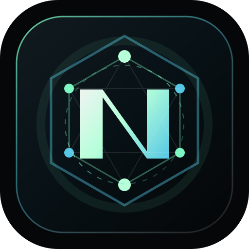
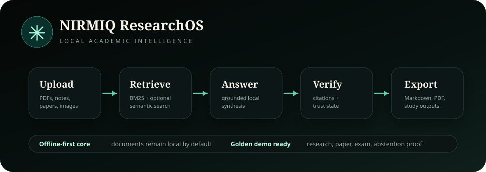
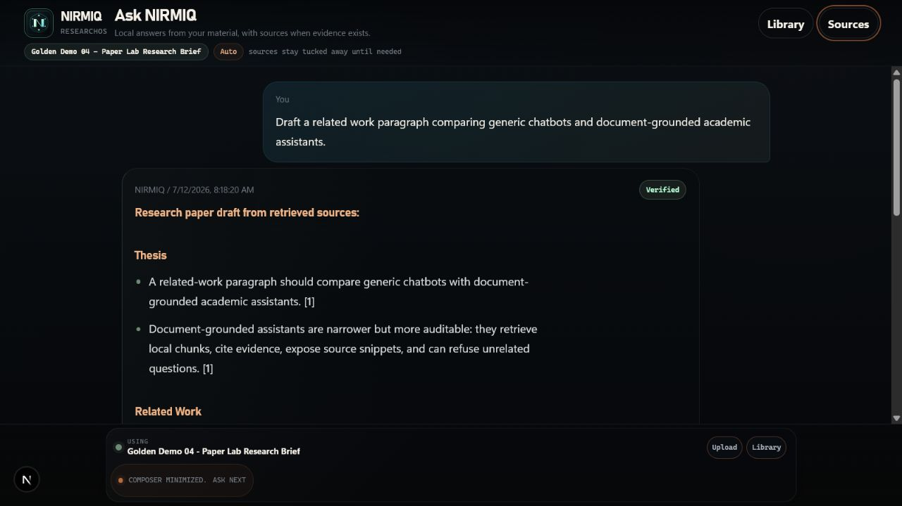
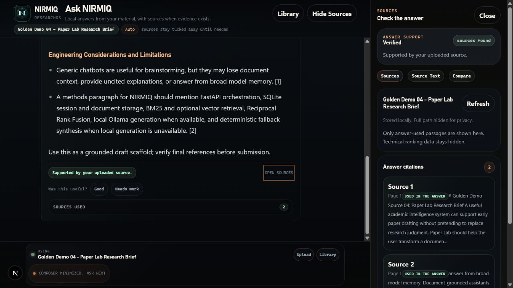

# NIRMIQ Academic Intelligence

> Upload. Understand. Verify. Learn.

[](https://github.com/SheeshDarth/NirmiqResearchOS/actions/workflows/ci.yml)






**NIRMIQ Academic Intelligence** is an offline-first academic document intelligence system built for students, researchers, and builders who need reliable answers from their own material.

It is not just a PDF chatbot.

It is a grounded academic knowledge assistant that helps users upload documents, ask questions, prepare for exams, draft research sections, retrieve source-backed answers, and understand complex content without hallucinated responses.

Core product direction: **NIRMIQ Academic Intelligence is the standalone academic workspace inside the broader NIRMIQ ecosystem.**

## Why NIRMIQ Exists

Students and early researchers increasingly use AI to understand PDFs, lecture notes, textbooks, slides, lab manuals, previous-year questions, screenshots, and research papers.

Most generic AI tools fail in the exact places academic work needs trust:

- They hallucinate confident answers.
- They lose uploaded document context.
- They hit token limits on long material.
- They provide uncited explanations.
- They struggle with messy PDFs and technical notes.
- They cannot reliably prove where an answer came from.
- They are not optimized for exam preparation or paper writing.

NIRMIQ Academic Intelligence was created to solve this problem.

The goal is simple:

> Give users accurate, source-grounded answers from their uploaded documents.

## Core Vision

NIRMIQ Academic Intelligence is a lightweight, offline-first, adaptive academic intelligence system capable of:

- Document understanding.
- Grounded question answering.
- Citation-aware responses.
- Whole-document summarization.
- Exam preparation.
- Research-paper drafting support.
- Multi-document retrieval.
- Contextual session memory.
- Low-hallucination synthesis.
- Local-first AI inference.

## Offline-First Contract

NIRMIQ uses a local FastAPI backend as part of the app runtime. This is **not** a cloud API dependency.

Core behavior is designed to work locally:

- Uploaded documents remain on the user's machine by default.
- The app can run without a ChatGPT/OpenAI-linked account.
- Ollama is optional for local generation.
- Deterministic fallback paths keep the app usable when local models are unavailable.
- Any future connected model/API-key mode must be opt-in and clearly disclose when document content leaves the machine.

## What Makes It Different

Most RAG apps follow a basic flow:

```text
Upload PDF
Chunk text
Embed chunks
Retrieve chunks
Ask LLM
Hope it does not hallucinate
```

NIRMIQ uses a more reliable academic flow:

```text
Upload document
Parse and normalize
Adaptive chunking
Hybrid retrieval
BM25 plus optional vector search
Reciprocal Rank Fusion
Reranking and context packing
Query-specific answer planning
Grounded local synthesis
Claim-level citation verification and repair
Student-friendly response
```

The focus is not just answering.

The focus is answering with evidence.

## Engineering Problem Log

NIRMIQ keeps a living engineering problem log in [`problems_faced.md`](problems_faced.md). It documents past failures, current RAG retrieval gaps, future risks, the hallucination root cause analysis, and the RAG Reliability Phase roadmap.

## Active Engineering Tracks

- [`docs/overnight_work_plan.md`](docs/overnight_work_plan.md): focused sprint plan for demo reliability, retrieval evaluation, citation selection, UI clarity, and release readiness.
- [`docs/megasprint_five_plan.md`](docs/megasprint_five_plan.md): release confidence, desktop packaging, privacy recovery, and public proof.
- [`docs/megasprint_six_plan.md`](docs/megasprint_six_plan.md): query-agnostic evidence obligations, hierarchical summary coverage, and the final 40-case offline reliability result.
- [`docs/recursive_summary_architecture.md`](docs/recursive_summary_architecture.md): all-chunk document mapping, recursive chapter reduction, cache behavior, and measured long-textbook results.
- [`docs/release_manifest_v0.5.md`](docs/release_manifest_v0.5.md): current reproducible tests, retrieval metrics, offline proof, package result, and honest release boundary.
- Ascension OS foundation now lives outside this repository at `C:\Users\Siddharth\Documents\Ascension OS` so NIRMIQ Academic Intelligence remains focused on academic document intelligence.

## Current Release Foundation

Implemented in the current repository:

- Bundled `Load Golden Demo` flow with four local academic Markdown sources.
- Electron desktop shell that starts the local runtime and opens NIRMIQ in a Windows app window.
- Desktop diagnostics menu for runtime status, recovery, a privacy-safe support bundle, VS Code, project docs, and local data access.
- Locked reviewer prompts for Research, Summary, Paper Lab, Exam Lab, and abstention behavior.
- Golden demo smoke script that fails if unsupported chat prompts return grounded answers.
- Local answer export as Markdown with citations.
- Whole-thread Markdown export from local session memory.
- Local answer feedback capture with `Good` / `Needs work` signals for future retrieval evaluation.
- Upload PDFs, text, Markdown, and images.
- Ingest local-path documents from trusted corpus roots.
- Summarize selected PDFs through an all-chunk recursive chapter/section map with original-page citations and content-hash caching.
- Ask grounded questions against selected sources.
- Inspect answer-used source passages and page references without exposing ranking metadata by default.
- Use four workspaces: Research, Chat, Paper Lab, and Exam Lab.
- Run hybrid retrieval with BM25, optional vector search, RRF, and reranking hooks.
- Use textbook-aware section metadata, soft section ranking, query-specific evidence obligations, and answer relevance diagnostics without exposing retrieval metadata in the normal UI.
- Use selected-document summary caching keyed by document id, content hash, and summary profile.
- Route query intent deterministically for summary, lookup, compare, deep research, paper, exam, chat, and unclear prompts.
- Show compact trust signals only as `Verified`, `Needs more evidence`, or `Not found in sources`.
- Fall back or abstain when direct source evidence, answer-used citations, or citation verification are weak.
- Abstain in Chat when retrieved material is unrelated to the actual question subject.
- Use Paper Lab for citation clusters, related-work matrix, suggested outline, and Markdown draft export.
- Use Exam Lab for marks-oriented answers, study guides, question-bank support, and printable custom PDFs.
- Check local publish readiness through `/health/readiness` and `scripts/publish_smoke.ps1`.
- Run with a low-memory local model profile: bounded Ollama context, bounded prediction length, short keep-alive, and batched embeddings.
- Use Local Data controls to clear one thread, remove indexed material and NIRMIQ-owned artifacts, or reset all app-local data while preserving external original files.
- Hardened retrieval/runtime path from the latest audit:
  - empty-text reindex attempts fail safely without wiping prior active chunks.
  - vector-only stale chunks are dropped unless they still exist as active SQLite chunks.
  - summary/factual seed chunks no longer inflate grounding confidence.
  - Exam Lab study guides judge relevance against imported question-bank text, not generic UI command words.
  - Docker Compose publishes only on `127.0.0.1` for local-first safety.
  - release scripts now fail on native command errors instead of producing false-green checks.

## What Works Now

- Upload and index PDF, Markdown, text, and image files locally.
- Ask selected-document questions with citations and trust metadata.
- Summarize selected PDFs with summary caching.
- Inspect evidence chunks in the Deep Research panel.
- Run Research, Chat, Paper Lab, and Exam Lab modes from one workspace.
- Export grounded answers/drafts as local Markdown.
- Export the current thread as local Markdown.
- Save answer-quality feedback locally for later accuracy tuning.
- Generate Exam Lab custom PDFs from grounded responses.
- Clear one thread, remove indexed material, or reset all NIRMIQ-local data from the privacy panel with explicit confirmation and deletion counts.
- Export a privacy-safe diagnostics ZIP containing status summaries only; raw logs, document text, prompts, answers, databases, uploads, filenames, and full local paths are excluded.
- Run local smoke checks, backend tests, and frontend production build.
- Evaluate retrieval on a bundled 30-question demo dataset.
- Evaluate query behavior through `data/processed/eval/query_agnostic_rag_categories.jsonl`, covering definitions, explanations, comparisons, procedures, limitations, visuals, summaries, exam answers, paper drafting, and unanswerable prompts.
- Rebuild and evaluate generated scans, handwriting, equations, tables, and an embedded diagram offline with `npm.cmd run eval:hard-docs`.
- Run GitHub CI for backend tests, API compile, frontend build, and Docker Compose validation.
- Run optional Docker dev containers with checked-in API and web Dockerfiles.
- Use `/api/v1/*` routes while preserving the original local API route paths.
- Enforce local request body limits, response compression, and scanner-clean SQLite migrations.
- Run the full publish gate with `npm.cmd run ship:check` or `NIRMIQ Ship Check.cmd`, including tests, compile, web build, smoke, and golden-demo abstention checks.
- Diagnose missing dependencies, stale ports, unsafe local overrides, and optional Ollama state with `npm.cmd run doctor` or `NIRMIQ Doctor.cmd` before startup.
- Reproduce the current release evidence from [`docs/release_manifest_v0.5.md`](docs/release_manifest_v0.5.md).

## Known Retrieval Status

The golden demo is strong, and the harder real-world seed now shows measurable improvement after the first RAG reliability slice:

| Real-world seed | BM25 MRR | Recall@8 | Citation expected coverage |
| --- | ---: | ---: | ---: |
| Before reliability slice | 0.578 | 0.750 | 0.750 |
| MegaSprint One final BM25 | 0.843 | 1.000 | 1.000 |
| MegaSprint One final Hybrid | 0.804 | 1.000 | 1.000 |
| Full-query BM25 answer path | 0.882 | 1.000 | 1.000 |
| Full-query Hybrid answer path | 0.882 | 1.000 | 1.000 |
| 40-case answer-quality BM25 path | 0.868 | 0.921 | 0.921 |
| MegaSprint Six final offline BM25 path | **0.921** | **1.000** | **1.000** |
| Hard-document OCR/structure gate | **1.000** | **1.000** | **1.000** |
| Post-hard-document 40-case regression | **0.934** | **1.000** | **1.000** |

The larger 40-case set covers definitions, explanations, mechanisms, comparisons, procedures, summaries, factual lookups, limitations, architecture questions, and unanswerable prompts. The final MegaSprint Six run passes all 40 quality cases with overall quality `0.937`, faithfulness `0.995`, readability `0.985`, and answerability correctness `1.000`. This is a strong measured result on the current corpus, not a production-grade arbitrary-document claim. BM25 remains the safest offline backbone, while hybrid remains optional support rather than the sole source of truth.

The core issue is not just model quality. Most hallucination risk comes from weak evidence selection: broad chunks, limited section awareness, lexical mismatch, and insufficient real-world labels. The canonical problem log is [`problems_faced.md`](problems_faced.md).

Chosen RAG method: [`NIRMIQ Evidence-First Hierarchical Hybrid RAG`](docs/nirmiq_rag_method.md). This keeps BM25 as the offline backbone, uses section/page-first narrowing when metadata exists, treats vector search as optional support, rescues buried direct evidence in legacy documents, and verifies citations before showing a confident answer.

Latest MegaSprint One reliability update:

- Retrieval now uses document-aware expansion for acronyms and source terminology.
- Candidate ranking includes an internal direct-evidence score so answerable passages beat loose mentions.
- Candidate priority was rebalanced so direct answer passages can outrank loosely related reranker hits.
- The real-world eval labels were corrected where OCR/wording damage hid valid source evidence.
- Legacy/no-section documents now get an anchor-rescue pass for direct definitions, dates, privacy/OCR variants, and exact answer cues.
- Default attached-source academic queries route to BM25-first retrieval internally while vector/hybrid remains optional.
- Broad index, glossary, backmatter, and example-list sections are penalized for explanatory questions.
- Synthesis now separates direct evidence, weak related mentions, and true source misses.
- A deterministic answer planner now identifies the requested subject, answer type, depth, and elements such as examples, comparisons, limitations, or diagram references.
- Required evidence obligations now describe what a valid answer must prove, and bounded per-obligation BM25 searches protect direct definitions, mechanisms, comparisons, interpretations, procedures, and workflow placement from loose keyword matches.
- Deterministic fallback synthesis assembles readable query-shaped answers only from obligation-satisfying passages and abstains when required evidence is missing.
- Selected-document whole-summary requests now inspect every readable chunk, reduce section/chapter facts recursively, filter sustained late index noise, and cite original pages.
- Exact source-derived acronym meanings lock query expansion so broad index/application terms cannot pull retrieval away from the requested concept.
- The local model now receives a query-specific answer contract and is told to connect evidence instead of copying disconnected fragments.
- Faithfulness handling now removes unsupported claims selectively and uses extractive fallback only when the repaired answer is not coherent.
- Normal UI hides raw metadata and presents only the trust state plus optional source passages.

## Completed Priority: Grounded Answer Intelligence

MegaSprint One Block B now closes on a 40-case full-query benchmark. Query-aware context packing, intent-shaped evidence ranking, definition rescue, citation-used evaluation, and fail-closed abstention convert retrieved passages into a more coherent answer tailored to the user's question.

This work belongs to **MegaSprint One, Block B**, not the UI sprint. It is documented in [`docs/megasprint_one_answer_intelligence_plan.md`](docs/megasprint_one_answer_intelligence_plan.md).

Remaining measured debt after MegaSprint Six:

- Convert saved `Needs work` feedback into local eval candidates.
- Broaden the new generated hard-document gate with independent real scans, noisier notes, additional handwriting styles, equations, tables, diagrams, and textbooks.
- Expand recursive-summary QA to more real books with malformed or missing heading metadata; parser-truncated titles remain visible rather than guessed.
- Continue Job 4 runtime optimization after the first BM25/selected-document cache block reduced the strict BM25 gate from `310.8s` to `274.3s`; details: [`docs/eval_runtime_optimization.md`](docs/eval_runtime_optimization.md).
- Keep BM25-only fallback fully usable for offline and low-end devices.
- Track chunk-selection reasons, section candidates, citation coverage, unsupported claims, latency, and memory behavior.
- Measure answer relevance, completeness, claim faithfulness, readability, and abstention correctness separately from retrieval rank.
- Reject answers that are merely related to the topic but do not explain what the user asked.

Acceptance targets:

- Preserve Recall@8 at or above `0.850` as the eval set grows.
- Preserve MRR at or above `0.700` as the eval set grows.
- Preserve expected citation coverage at or above `0.900` as the eval set grows.
- Preserve the golden demo results and the no-Ollama/no-Chroma fallback path.

## Workspaces

### Research

For regular and deep research over uploaded documents.

Use it to:

- Summarize a PDF.
- Explain a concept from a source.
- Ask technical questions.
- Compare ideas across material.
- Inspect citations only when needed.

### Chat

For general conversation in a local-first assistant lane.

Current MVP behavior:

- Uses uploaded documents when relevant.
- Can use session context.
- Abstains when there is not enough local evidence.
- Does not require an external AI provider.

Future connected behavior should be opt-in only.

### Paper Lab

For engineering students and early researchers building citation-backed academic work.

Current foundation supports:

- Paper section drafting from retrieved sources.
- Related-work matrix previews.
- Citation clusters.
- Suggested outline.
- Copyable Markdown draft package.

### Exam Lab

For exam preparation from uploaded notes, textbooks, PDFs, diagrams, and question banks.

Current foundation supports:

- Exam-style answers.
- Study-guide generation.
- Important question workflows.
- Printable custom PDF output from grounded responses.

## Evidence Trail

Every strong answer should be traceable.

NIRMIQ surfaces:

- Source document.
- Page number.
- Supporting evidence.
- Compact trust status.

This lets users verify the answer instead of blindly trusting it.

## Tech Stack

Backend:

- FastAPI.
- Python.
- SQLite.
- ChromaDB as optional vector storage.
- PyMuPDF.
- Tesseract OCR adapter.
- BM25 retrieval.
- Ollama adapter for local generation.

Frontend:

- Next.js.
- TypeScript.
- PWA-ready app structure.

Retrieval and synthesis:

- BM25 lexical retrieval.
- Optional semantic vector retrieval.
- Reciprocal Rank Fusion.
- Reranking hooks.
- Context packing.
- Citation-aware grounded synthesis.
- Citation coverage metadata.
- Faithfulness rewrite fallback.

Model strategy:

- Local-first inference.
- RTX 4050-friendly constraints.
- Low VRAM preference.
- Balanced local generator: Apache-2.0 `qwen3.5:4b`, with Ollama thinking disabled so the bounded output budget produces the visible answer.
- Low-memory local generator: MIT-licensed `phi3:mini`.
- `qwen2.5` is explicit opt-in only because the installed artifact carries a separate non-commercial research license.
- Optional `nomic-embed-text` embeddings and coding-specific models are never required for the offline fallback path.

## Architecture

```text
Next.js frontend
Local FastAPI backend
Ingestion service
Indexing service
Retrieval service
Memory service
Synthesis service
Verification and trust layer
SQLite plus optional Chroma storage
```

## Repository Structure

```text
C:\Nirmiq-researchOS
apps/
  api/                  FastAPI backend
  web/                  Next.js frontend
data/
  raw/                  Uploaded/local source documents
  processed/            Parsed pages, chunks, diagrams, eval data
  indexes/              Local retrieval/vector indexes
  sqlite/               Local database files
docs/                   Product, security, publish, and architecture docs
scripts/                Local startup, smoke, and evaluation scripts
nirmiq_codex_docs/      Codex planning and handoff knowledge base
README.md               GitHub-facing project overview
context.md              Current project memory and implementation log
```

## Quick Start

Install once:

```powershell
cd C:\Nirmiq-researchOS
.\scripts\bootstrap.ps1
```

For fluent local generation on Windows/RTX 4050-class hardware, install the balanced Apache-2.0 model once:

```powershell
ollama pull qwen3.5:4b
```

For lower-memory hardware, use `ollama pull phi3:mini` and set `NIRMIQ_RUNTIME_PROFILE=low_memory`.

Ollama is optional. If it or the model is unavailable, NIRMIQ keeps the same local document workflow and uses deterministic cited synthesis instead of making a cloud call.

Root command hub:

```powershell
cd C:\Nirmiq-researchOS
npm.cmd run start
npm.cmd run start:golden
npm.cmd run doctor
npm.cmd run diagnostics
npm.cmd run desktop
npm.cmd run desktop:smoke
npm.cmd run ship:check
```

Run the desktop app:

```powershell
cd C:\Nirmiq-researchOS
npm.cmd run desktop:install
npm.cmd run desktop
```

Or double-click:

```text
NIRMIQ Desktop.cmd
```

The desktop shell starts the same local FastAPI and Next.js runtime, then opens NIRMIQ in an app window. Its menu includes runtime status, recovery, safe diagnostics export, local logs, VS Code, project files, `context.md`, the README, and debugging docs.

Create a privacy-safe local support bundle without starting the app:

```powershell
npm.cmd run diagnostics
```

The ZIP is written under `temp/diagnostics` and is never uploaded automatically.

Run the repeatable desktop smoke check:

```powershell
cd C:\Nirmiq-researchOS
npm.cmd run desktop:smoke
```

This launches the Electron shell, waits for local API/web readiness, confirms NIRMIQ branding, verifies `cloud_api_required=false`, and then cleans up the smoke-started runtime.

Run local preview:

```powershell
cd C:\Nirmiq-researchOS
.\scripts\start_local.ps1 -OpenBrowser
```

Or double-click:

```text
NIRMIQ Academic Intelligence.cmd
```

Run local preview and warm-start the bundled golden demo:

```powershell
cd C:\Nirmiq-researchOS
.\scripts\start_local.ps1 -GoldenDemo -OpenBrowser
```

Or double-click:

```text
NIRMIQ Golden Demo.cmd
```

Stop processes started by the launcher:

```powershell
cd C:\Nirmiq-researchOS
.\scripts\stop_local.ps1
```

Or double-click:

```text
NIRMIQ Stop.cmd
```

Create desktop shortcuts:

```powershell
cd C:\Nirmiq-researchOS
.\scripts\create_windows_shortcut.ps1 -Desktop
```

Useful local URLs after the app starts:

- Web: `http://127.0.0.1:3002`
- Local backend: `http://127.0.0.1:8000`
- Readiness: `http://127.0.0.1:8000/health/readiness`

## Docker Dev Run

Docker is optional. The Windows PowerShell launcher is the primary local path.

Fresh Docker dev start:

```powershell
cd C:\Nirmiq-researchOS
docker compose -f docker-compose.local.yml up
```

Then open:

- Web: `http://127.0.0.1:3002`
- API health: `http://127.0.0.1:8000/health`

Notes:

- The compose file builds checked-in API and web Dockerfiles.
- Ollama is disabled by default in Docker compose so the demo works without GPU passthrough.
- For best local model performance on Windows, use `scripts/start_local.ps1` instead of Docker.

## Linux And Low-End Devices

Linux is feasible through browser-preview mode. On low-end devices, keep the app BM25/extractive-first and leave Ollama optional.

```bash
python -m pip install -e apps/api
npm --prefix apps/web install
bash scripts/start_local.sh
```

Open `http://127.0.0.1:3002`.

Stop:

```bash
bash scripts/stop_local.sh
```

CI validation:

```bash
npm run smoke:linux
```

Details: [Linux and low-end feasibility](docs/linux_low_end_feasibility.md) and [Linux runtime validation](docs/linux_runtime_validation.md).

## Demo Dataset And Retrieval Results

NIRMIQ includes a small, original PDF demo dataset for recruiters and reviewers:

- `data/raw/demo_pdfs/nirmiq_rag_reference.pdf`
- `data/raw/demo_pdfs/nirmiq_exam_reference.pdf`
- `data/processed/eval/demo_academic_qa.jsonl`

Load and evaluate:

```powershell
cd C:\Nirmiq-researchOS
.\scripts\start_local.ps1
.\scripts\load_demo_dataset.ps1 -ForceReindex
.\scripts\eval_demo_dataset.ps1
```

Latest local retrieval results on 30 labeled questions:

| Mode | MRR | Recall@3 | Recall@5 | Recall@8 | nDCG@3 | Citation expected coverage |
| --- | ---: | ---: | ---: | ---: | ---: | ---: |
| Hybrid | 0.983 | 1.00 | 1.00 | 1.00 | 0.869 | 1.00 |
| BM25 | 0.983 | 1.00 | 1.00 | 1.00 | 0.859 | 1.00 |

Details:

- [Demo dataset](docs/demo_dataset.md)
- [Retrieval evaluation results](docs/retrieval_eval_results.md)
- [NIRMIQ RAG method](docs/nirmiq_rag_method.md)
- [MegaSprint One grounded answer intelligence plan](docs/megasprint_one_answer_intelligence_plan.md)
- [MegaSprint Two UX plan](docs/megasprint_two_plan.md)
- [MegaSprint Three academic workflow plan](docs/megasprint_three_plan.md)
- [MegaSprint Four local runtime plan](docs/megasprint_four_plan.md)
- [MegaSprint Six reliability plan and result](docs/megasprint_six_plan.md)
- [Benchmark report](docs/benchmark_report.md)
- [Linux and low-end feasibility](docs/linux_low_end_feasibility.md)
- [Linux runtime validation](docs/linux_runtime_validation.md)
- [Engineering problem log and RAG Reliability roadmap](problems_faced.md)
- [Recursive summary reliability gate](docs/summary_reliability.md)

Real-world seed eval now also exists for actual local academic material:

- `data/raw/attention_is_all_you_need.pdf`
- `data/raw/uploads/Hands-On-Machine-Learning-with-Scikit-Learn-Keras-and-TensorFlow-3rd-Ed.---Annot-5b287bd745.pdf`
- `data/raw/uploads/mod-5-gen-ai-708567b729.pdf`
- `data/processed/eval/real_world_academic_seed.jsonl`

Note: the real-world source PDFs are local/private or copyright-sensitive and are intentionally not committed. The labels and metrics are committed so the evaluation method is visible; replace `source_file` paths with your own local academic PDFs to reproduce or expand it.

Latest phrase-level real-world retrieval result:

| Mode | Samples | MRR | Recall@3 | Recall@5 | Recall@8 | Citation expected coverage |
| --- | ---: | ---: | ---: | ---: | ---: | ---: |
| BM25 | 17 | 0.843 | 1.000 | 1.000 | 1.000 | 1.000 |
| Hybrid | 17 | 0.804 | 1.000 | 1.000 | 1.000 | 1.000 |

Latest refresh: 2026-07-12. The current failure log contains no active weak retrieval records on this 17-sample seed.

Measure the active local runtime without sending data to a cloud service:

```powershell
npm run benchmark:runtime
```

Use `NIRMIQ_RUNTIME_PROFILE=auto`, `balanced`, `low_memory`, or `cpu_offline` to select coherent runtime defaults. Normal users do not need to configure individual model or retrieval variables.

Run:

```powershell
.\scripts\eval_real_world.ps1
```

This seed set is intentionally harder than the golden demo and is the baseline for the RAG Reliability Phase. The goal is to improve retrieval precision and citation coverage before increasing model size, temperature, or context length.

The current strict full-query benchmark scores expected evidence against the complete chunks actually cited by each answer, not truncated UI previews or unused retrieval candidates:

| Mode | Samples | MRR | Recall@3 | Recall@8 | Citation expected coverage | Quality pass | Faithfulness |
| --- | ---: | ---: | ---: | ---: | ---: | ---: | ---: |
| BM25 offline | 40 | 0.921 | 1.000 | 1.000 | 1.000 | 1.000 | 0.995 |

The two deliberately unsupported prompts abstained correctly. The empty canonical failure file means no case in this particular labeled set is currently below the evaluator threshold; it does not mean every future document or query is solved.

Run the separate hard-document gate after installing Tesseract OCR:

```powershell
npm.cmd run eval:hard-docs
```

It regenerates raster-only scans, a handwriting-style image, a formula page, a table, and an embedded diagram; ingests them through the real API; and evaluates nine offline query categories. The current result is MRR `1.000`, Recall@8 `1.000`, expected citation coverage `1.000`, answer-quality pass `1.000`, faithfulness `0.978`, and answerability correctness `1.000`. The separate 40-case academic regression also remains `40/40` and now records MRR `0.934`. See [`docs/hard_document_eval.md`](docs/hard_document_eval.md) for scope and limitations.

## Screenshots And GIFs

Committed visual asset:

- `docs/assets/nirmiq-demo-flow.svg`

Live UI captures from the verified golden-demo path:






Remaining recommended public README assets:

- Paper Lab and Exam Lab workflow captures.
- Optional GIF: upload -> ask -> citation trail.

Capture checklist: [Demo assets guide](docs/demo_assets.md).

## Publish Smoke Check

Strongest EOD check:

```powershell
cd C:\Nirmiq-researchOS
npm.cmd run ship:check
npm.cmd run desktop:smoke
```

Windows double-click alternative:

```text
NIRMIQ Ship Check.cmd
```

`ship:check` runs backend tests, API compile, frontend production build, local smoke, the golden demo, abstention, and a privacy-safe diagnostics export. `desktop:smoke` separately validates the Electron shell startup path.

If backend and frontend are already running and you only want the lightweight smoke:

```powershell
cd C:\Nirmiq-researchOS
.\scripts\publish_smoke.ps1
```

Expected:

- Local backend health returns `ok`.
- Readiness reports local-first status.
- Readiness reports `cloud_api_required=false`.
- Web shell includes NIRMIQ branding.

## Ship Readiness

Current public-release posture:

- Intended release type: local-first portfolio/demo MVP.
- Not intended yet: hosted multi-user SaaS.
- CI: `.github/workflows/ci.yml` verifies backend tests, compile, web build, and Docker Compose config.
- Ownership: `.github/CODEOWNERS` routes project ownership to `@SheeshDarth`.
- License: MIT.
- Security: request body limits, baseline security headers, optional production HSTS/CSP toggles, CORS allowlist, upload sniffing, and local-path ingestion restrictions.
- Privacy recovery: explicit thread clear, indexed-material purge, full app-local reset, and diagnostics that contain no raw user content.
- API stability: existing routes are preserved, with `/api/v1` aliases available for future clients.

## Golden Demo

The fastest way to review NIRMIQ is the bundled offline golden demo.

One-command path:

```powershell
cd C:\Nirmiq-researchOS
.\scripts\run_local.ps1 -GoldenDemo -OpenBrowser
```

Backend-only warm-start:

```powershell
cd C:\Nirmiq-researchOS
.\scripts\golden_demo.ps1
```

Then open `http://127.0.0.1:3002`, log in with a local profile, and click `Load Golden Demo`.

The golden path proves:

- Local corpus indexing without internet.
- Research answers with citations.
- Evidence chips that open focused source chunks.
- Paper Lab citation-backed drafting.
- Exam Lab marks-oriented answers.
- Abstention behavior for unsupported general questions.
- Local Markdown export of answer plus citations.
- Selected source removal as the privacy/purge moment.

Latest verified walkthrough:

- `npm.cmd run ship:check`: passed on 2026-07-15 with `163` backend tests and a `118 kB` first-load web bundle.
- `npm.cmd run desktop:smoke` and `npm.cmd run desktop:portable-smoke`: passed on 2026-07-15.
- Golden demo grounded prompts returned citations.
- Unsupported prompt returned `grounded=false` and `citations=0`.
- Desktop shell verified local API/web readiness and `cloud_api_required=false`.
- Privacy-safe diagnostics export passed inside the ship gate.

Primary demo docs:

- [Golden demo script](docs/demo_script.md)
- [Golden benchmark report](docs/benchmark_report.md)
- [Folio competitive review](docs/folio_competitive_review.md)
- [Windows app packaging](docs/windows_app_packaging.md)
- [Publish checklist](docs/publish_checklist.md)

## Tests

```powershell
cd C:\Nirmiq-researchOS
.\scripts\test_api.ps1
npm.cmd run compile:api
npm.cmd run build
```

## Demo Flow

1. Open the app.
2. Enter local profile details.
3. Upload or select a PDF.
4. Click `Summarize PDF`.
5. Inspect citations in `Deep Research`.
6. Switch to `Paper Lab`.
7. Ask for a related-work or methodology section.
8. Show the outline, citation clusters, and related-work matrix.
9. Click `Copy Markdown Draft`.
10. Switch to `Exam Lab` and generate a study guide or custom PDF.

## Evaluation Goals

NIRMIQ aims to measure answer quality instead of relying on vibes.

Useful metrics:

- Recall@K.
- MRR.
- Citation coverage.
- Grounding strength.
- Abstention correctness.
- Hallucination flags.
- Retrieval latency.
- Context token usage.

## Philosophy

```text
Trust over fluency
Evidence over guessing
Retrieval quality over model size
Student learning over AI showmanship
Offline access over cloud dependency
```

## Important Docs

- [Publish checklist](docs/publish_checklist.md)
- [Ship readiness notes](docs/ship_readiness.md)
- [Release manifest v0.5](docs/release_manifest_v0.5.md)
- [Release notes v0.5](docs/release_notes_v0.5.md)
- [Privacy policy](docs/privacy_policy.md)
- [Security notes](docs/security.md)
- [Demo dataset](docs/demo_dataset.md)
- [Retrieval evaluation results](docs/retrieval_eval_results.md)
- [MegaSprint Six reliability plan](docs/megasprint_six_plan.md)
- [Demo assets guide](docs/demo_assets.md)
- [Backend architecture](backend_architecture.md)
- [Product requirements](prd.md)
- [Technical requirements](trd.md)
- [UI/UX specification](UI_UX.md)
- [Debugging guide](debugging.md)
- [Accuracy and hallucination audit](docs/accuracy_precision_audit.md)
- [Local model optimization](docs/local_model_optimization.md)
- [Internship impact plan](docs/internship_impact_plan.md)
- [NIRMIQ ecosystem](docs/nirmiq_ecosystem.md)

## Current Status

This project is under active development.

NIRMIQ Academic Intelligence is being built as a solo-developer AI systems project focused on practical student problems, local AI infrastructure, trustworthy document intelligence, and publishable portfolio value.

## Author

Built by Siddharth as part of the NIRMIQ ecosystem.

## License

MIT. See [LICENSE](LICENSE).
