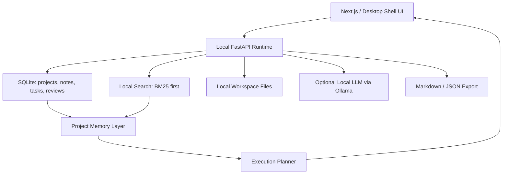

# Ascension OS Foundation

Last updated: 2026-07-07

Status: initial foundation draft.

## Positioning

Ascension OS should be treated as a separate product track from NIRMIQ ResearchOS.

NIRMIQ ResearchOS is an academic document intelligence workspace. Ascension OS can become a broader local-first execution workspace for personal projects, learning, goals, and operating routines.

The separation matters because NIRMIQ must stay simple for students and researchers. Ascension OS can be wider, but it should not drag extra complexity into the academic product.

## Working Definition

Ascension OS is a local-first personal execution operating system that helps a builder plan, focus, execute, review, and improve across projects.

In one line:

> Ascension OS turns goals, notes, tasks, research, and reflections into a calm local workspace for deliberate execution.

## Core Users

- Solo builders managing many projects.
- Students balancing study, internships, papers, and skill-building.
- Creators tracking ideas, research, scripts, and publishing workflows.
- Developers who want local-first planning and memory without cloud lock-in.

## Product Principles

- Local-first by default.
- Calm interface, not a noisy productivity dashboard.
- Human-led execution, not fake autonomy.
- Memory-aware, but explainable.
- Modular enough to connect with NIRMIQ later.
- Useful without internet.
- No social feed, gamified streak addiction, or unnecessary analytics.

## MVP Scope

### 1. Command Center

The main daily workspace.

Capabilities:

- Today plan.
- Active projects.
- Next actions.
- Focus session launcher.
- Quick capture.
- Review queue.

### 2. Project Memory

Stores durable project context.

Capabilities:

- Project overview.
- Decisions.
- Open questions.
- Useful links and notes.
- Milestones.
- Retrospectives.

### 3. Execution Loop

Turns intention into action.

Flow:

```text
Capture
Clarify
Plan
Execute
Review
Archive or continue
```

### 4. Local Intelligence Layer

Uses local retrieval and optional local LLMs to summarize, organize, and suggest next actions.

Initial behavior:

- Summarize project state.
- Detect stale tasks.
- Propose next actions from notes.
- Create daily review prompts.
- Explain why a suggestion was made.

### 5. Integration Boundary

Ascension OS can later connect to NIRMIQ modules, but should not depend on them.

Possible future links:

- NIRMIQ ResearchOS provides academic evidence and paper workflows.
- NIRMIQ Mirror provides long-term personal context.
- NIRMIQ Agent System coordinates multi-step work.
- NIRMIQ Echo provides voice interaction.

## Non-Goals For The First Version

- No multi-user features.
- No team workspace.
- No enterprise admin.
- No cloud requirement.
- No heavy agentic automation.
- No calendar/email integration until the local execution loop is proven.
- No complex graph database in the MVP.

## Suggested Architecture



## Minimal Data Model

Tables for the first slice:

- `projects`
- `notes`
- `tasks`
- `decisions`
- `reviews`
- `sessions`
- `artifacts`

Important fields:

- `id`
- `title`
- `body`
- `status`
- `project_id`
- `created_at`
- `updated_at`
- `source_type`
- `source_path`
- `tags_json`

## First Implementation Slice

Build only a thin foundation first:

1. Create a separate repo or top-level `ascension-os` workspace only after the product boundary is confirmed.
2. Draft PRD and TRD.
3. Build a local SQLite schema.
4. Build a minimal command center page.
5. Add quick capture.
6. Add project memory summary.
7. Add export/import.

## Relationship To NIRMIQ ResearchOS

Ascension OS should not replace NIRMIQ ResearchOS.

Recommended relationship:

- NIRMIQ ResearchOS remains the academic intelligence system.
- Ascension OS becomes the personal execution shell.
- Both can share local-first principles and some utility libraries later.
- Integration should happen through explicit adapters, not shared hidden state.

## Immediate Next Step

Before writing production code, create:

- `docs/ascension_os_prd.md`
- `docs/ascension_os_trd.md`
- `docs/ascension_os_ui_ux.md`
- `docs/ascension_os_mvp_plan.md`

This keeps Ascension OS clear enough to build without weakening the current NIRMIQ demo sprint.

