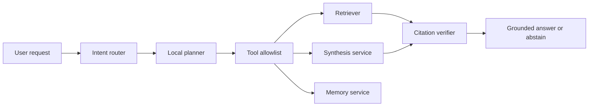

# NIRMIQ Local Agent Plan

Last updated: 2026-06-02

## Goal

Create a local-first AI agent layer for NIRMIQ Academic Intelligence System that can coordinate research, summarization, exam prep, and paper drafting without cloud API usage by default.

## What "Local Agent" Means

The agent is not an unrestricted autonomous process. It is a controlled orchestrator that runs on the user's machine and uses local tools.

Allowed by default:

- Retrieve indexed document chunks.
- Summarize selected local documents.
- Compare uploaded sources.
- Draft grounded answers with citations.
- Build exam study guides from uploaded notes/question banks.
- Propose next actions.

Not allowed by default:

- Access arbitrary filesystem paths.
- Send document content to internet APIs.
- Execute shell commands.
- Modify files outside explicit project/export locations.
- Claim unsupported facts without source evidence.

## Architecture

## Tool Allowlist

Initial tools should stay narrow:

- `retrieve_context(query, document_id, mode)`
- `summarize_document(document_id, profile)`
- `compare_sources(document_ids, query)`
- `draft_exam_answer(question, profile)`
- `draft_paper_section(topic, selected_sources)`
- `read_session_memory(session_id)`

## Safety Protocol

- All tool calls use typed schemas.
- All document access is limited to indexed documents or configured corpus roots.
- Any future file-write tool writes only to `data/exports` unless the user approves a path.
- Any connected/cloud mode must show a visible consent state before sending content out.
- Generated claims must pass citation verification or be rewritten extractively.

## RTX 4050 Strategy

- Keep one generation model active at a time.
- Prefer Phi/Qwen small models for general synthesis.
- Use DeepSeek Coder only for code-heavy tasks.
- Avoid local semantic entailment by default unless latency remains acceptable.
- Use deterministic fallback when Ollama is unavailable.

## Implementation Order

1. Deterministic intent router.
2. Typed local tool registry.
3. Planner prompt that selects only allowed tools.
4. Retrieval and citation-verification loop.
5. Agent trace metadata for debugging.
6. Optional UI "Agent Trace" panel hidden behind an advanced toggle.

## MVP Tradeoff

This approach avoids the fake-autonomy trap. It gives NIRMIQ useful local agent behavior while protecting user documents and keeping the interface simple.
