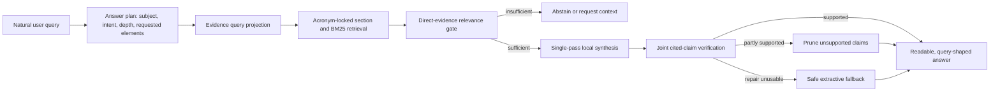

# MegaSprint One, Block B: Grounded Answer Intelligence

Last updated: 2026-07-15
Status: complete on the 40-case reliability gate; ongoing quality debt remains tracked

## Goal

Turn retrieved textbook evidence into a clear, query-specific answer without guessing. The system must do more than return passages that contain the same words as the prompt.

This block is part of MegaSprint One because answer quality depends on the complete RAG path:

1. Understand what the user is asking.
2. Find evidence that directly answers it.
3. Connect that evidence into a coherent explanation.
4. Cite the claims actually used.
5. Remove unsupported claims or abstain.

UI and release work remain important, but they cannot compensate for an answer pipeline that retrieves related fragments and presents them as understanding.

## Architecture

## Implemented Slice

### B1. Deterministic Answer Planning

- Detects concept explanation, mechanism, comparison, procedure, limitation, enumeration, summary, paper, exam, and direct-answer requests.
- Extracts the subject, requested depth, and optional elements such as examples, applications, limitations, equations, and diagram references.
- Keeps the public `POST /query` request contract unchanged.
- Uses the plan to shape both retrieval and the local-model instruction.

### B2. Query-Safe Retrieval

- Removes presentation-only wording such as `in detail`, `with image references`, and `from this textbook` from the evidence query.
- Preserves clean prompts byte-for-byte so normal queries are not unnecessarily rewritten.
- Locks document-derived acronym expansion when an exact source meaning is found. For example, `CNN` expands to the source's long form without importing every term from a broad application or index section.
- Continues to use the original query for final direct-evidence scoring.

### B3. Query-Shaped Local Synthesis

- Instructs the local model to answer the exact requested subject and structure.
- Requires coherent explanation rather than copied index entries or disconnected passages.
- Prevents a mechanism from being inferred from analogy, history, or biological inspiration unless the source explicitly supports it.
- Uses paragraph-level or bullet-level citations without exposing retrieval metadata in the normal UI.

### B4. Claim-Level Safety

- Verifies a claim against all passages it cites jointly, so a claim supported across two passages is not incorrectly rejected.
- Removes only unsupported claims when the remaining answer is coherent and sufficiently cited.
- Rejects naked citation anchors, orphan headings, and partial sentence fragments after repair.
- Falls back to a source-only extractive answer when selective repair is not usable.
- Abstains when direct evidence is absent.

### B5. Balanced Local Model Policy

- Balanced profile: `qwen3.5:4b`, Apache 2.0, with Ollama thinking disabled so the answer budget is used for visible output.
- Low-memory profile: `phi3:mini`, MIT licensed.
- CPU-offline profile: BM25 plus deterministic cited synthesis; no Ollama dependency.
- `qwen2.5` remains explicit opt-in only because its installed model artifact carries a separate non-commercial research license.

## Verification So Far

Retrieval-only real-world seed, 17 labeled questions:

| Mode | MRR | Recall@3 | Recall@8 | Expected citation coverage |
| --- | ---: | ---: | ---: | ---: |
| BM25 | 0.868 | 0.941 | 1.000 | 1.000 |
| Hybrid | 0.828 | 0.941 | 1.000 | 1.000 |

Full-query real-world seed:

| Mode | MRR | Recall@8 | Expected citation coverage | Grounded response coverage |
| --- | ---: | ---: | ---: | ---: |
| BM25 | 0.902 | 1.000 | 1.000 | 1.000 |
| Hybrid | 0.902 | 1.000 | 1.000 | 1.000 |

Live selected-textbook checks:

- `Explain CNN in detail`: retrieved the CNN chapter instead of semantic-segmentation/index fragments; generated claims were citation-checked and unsupported additions were removed.
- `What is a Gaussian mixture model?`: returned a definition and mechanism from the relevant textbook passages instead of a keyword list.
- Random-forest comparison: produced a coherent comparison after orphan-fragment repair.
- Unsupported quantum-teleportation query: abstained instead of borrowing unrelated textbook material.

These are acceptance checks, not a claim of arbitrary-query perfection. The current real-world set remains too small for that claim.

Regression verification:

- Backend unit and integration tests: `126 passed`, `1 warning`.
- Python API compile check: passed.
- Next.js production build: passed; first-load JavaScript `117 kB`.

## Closure Result

- Added a 40-case dataset spanning papers, a large textbook, notes, and unanswerable questions.
- Added automated answer relevance, concept coverage, query focus, plan compliance, readability, faithfulness, and answerability scoring.
- Added query-aware context packing so long early chunks cannot hide later direct evidence.
- Added concept, mechanism, procedure, recommendation, interpretation, comparison, and limitation evidence contracts.
- Added strict definition rescue for source phrasing such as `called <subject>` and page-neighbor rescue for legacy PDFs without headings.
- Preserved answer-used citation scoring: retrieval only receives credit when final cited passages contain expected support.

Final strict offline BM25 full-query result:

| Samples | MRR | Recall@3 | Recall@8 | Expected citation coverage | Answer-quality pass | Faithfulness | Answerability correctness |
| ---: | ---: | ---: | ---: | ---: | ---: | ---: | ---: |
| 40 | 0.868 | 0.921 | 0.921 | 0.921 | 0.825 | 0.985 | 1.000 |

Verification:

- Backend unit and integration tests: `160 passed`, `1 warning`.
- Python API compile check: passed.
- Next.js production build: passed; first-load JavaScript remained `117 kB`.
- Targeted CNN and transfer-learning evaluation: `1.000` citation coverage, readability, faithfulness, and answer-quality pass rate.

Known debt after closure:

- Seven of 40 cases remain below the answer-quality pass threshold, primarily summary/list readability and four low-relevance mechanism/procedure cases.
- Three expected source-phrase cases remain absent from answer-used citations.
- The strict full-query benchmark takes about four minutes against the legacy 1,800+ chunk textbook index.
- Refactor the verifier and answer composer out of the large synthesis service only after behavior remains stable across another dataset expansion.

## Non-Goals

- No cloud API requirement.
- No multi-agent answer loop.
- No graph database.
- No larger model as a substitute for retrieval precision.
- No visible advanced retrieval controls in the normal chat UI.

## Completion Gate

MegaSprint One Block B is complete only when:

- Evidence directly answers diverse valid queries, not a fixed prompt list.
- Answers follow the user's requested scope and depth.
- Unsupported queries abstain.
- Citations support the claims beside them.
- Selective repair never leaves broken prose.
- Recall@8 remains at least `0.850`, MRR remains at least `0.700`, and expected citation coverage remains at least `0.900` as the eval set grows.
- The app remains useful without Chroma, a reranker, Ollama, graph infrastructure, or cloud access.
