# MegaSprint Six: Query-Agnostic Evidence Reliability

Status: Complete on the current 40-case offline gate

Last verified: 2026-07-19

## Objective

Close the remaining measured failures in summaries, enumerations, mechanisms, procedures, comparisons, and numeric interpretation without hard-coding textbook answers or adding cloud dependencies, a graph database, a large reranker, or a larger model.

The sprint treats answer quality as an evidence-selection problem:

> A response is useful only when NIRMIQ retrieves the passages needed to satisfy the user's actual question and turns those passages into a readable answer.

## Architecture

```mermaid
flowchart LR
    Q["Natural user query"] --> P["Deterministic answer plan"]
    P --> O["Required and optional evidence obligations"]
    O --> B["Batched BM25 searches per obligation"]
    B --> S["Soft section ranking and bounded rescue"]
    S --> G["Subject plus obligation relevance gate"]
    G --> C["Multi-obligation context packing"]
    C --> Y{"Local generation usable?"}
    Y -->|"yes"| L["One bounded local synthesis pass"]
    Y -->|"no or rejected"| F["Deterministic query-shaped fallback"]
    L --> V["Claim and citation verification"]
    F --> V
    V -->|"supported"| A["Readable answer with paragraph citations"]
    V -->|"missing required evidence"| N["Abstain or request more evidence"]

    D["Selected-document summary"] --> H["Section/page hierarchy groups"]
    H --> E["Representative original chunks"]
    E --> C
```

## Delivered

- Added generic `EvidenceObligation` and `AnswerPlan` contracts for definitions, explanations, mechanisms, comparisons, procedures, workflow placement, interpretations, summaries, and factual lookup.
- Added batched per-obligation BM25 retrieval so one broad expanded query cannot dominate all evidence selection.
- Added bounded obligation recovery, lexical top-hit preservation, page-neighbor rescue, roadmap rescue, and direct anchor rescue.
- Kept section-first behavior soft: section metadata contributes ranking evidence but cannot remove a strong direct lexical hit.
- Added relation-aware comparison scoring so a passage must describe the named side, not merely contain the side label near unrelated headings.
- Added operation-focus and result-target matching for mechanism questions.
- Added complete numeric-scale interpretation for questions such as metric ranges.
- Expanded bounded synthesis inspection to 12 candidates while retaining the existing global context-token budget.
- Mapped citation anchors through the full inspected context range and returned only answer-used citations.
- Added deterministic comparison, interpretation, mechanism, procedure, and workflow fallbacks that remain source-only.
- Added hierarchical summary seed selection across section groups or page spans, with summary cache profile `v6-hierarchical`.
- Removed topic-specific Gaussian-mixture fallback rewriting; reliability logic remains query-agnostic.
- Added and expanded unit coverage for answer planning, retrieval policy, BM25 morphology, fallback quality, citation faithfulness, and hierarchical summary selection.

## Final Strict Offline Evaluation

Dataset: `data/processed/eval/real_world_answer_quality.jsonl`

Configuration:

- BM25 retrieval only.
- Ollama generation disabled.
- Ollama embeddings disabled.
- Ollama reranker disabled.
- Vector retrieval disabled.
- Low-memory mode enabled.
- Full query pipeline and answer-used citation scoring.

| Metric | Before MegaSprint Six | Final |
| --- | ---: | ---: |
| MRR | 0.868 | **0.921** |
| Recall@3 | 0.921 | **1.000** |
| Recall@8 | 0.921 | **1.000** |
| Expected citation coverage | 0.921 | **1.000** |
| Answer-quality pass | 0.825 | **1.000** |
| Overall answer quality | not recorded as closure metric | **0.937** |
| Readability | 0.939 | **0.985** |
| Faithfulness | 0.985 | **0.995** |
| Answerability correctness | 1.000 | **1.000** |

All `40/40` cases passed. Both intentionally unanswerable cases abstained correctly. The canonical failure file is empty for this dataset.

## Verification

- Focused answer-planning and synthesis tests: `49 passed`.
- Full backend unit suite: `202 passed`, one third-party deprecation warning.
- Integration suite: `10 passed`, one third-party deprecation warning.
- Python compile: passed.
- Next.js production build: passed at `118 kB` first-load JavaScript.
- Strict 40-case final benchmark: passed with no recorded failures.
- Full `npm run ship:check`: passed with `212` backend tests, local readiness, web-shell smoke, four grounded golden-demo routes, unsupported-query abstention with zero citations, and privacy-safe diagnostics export.
- Full `npm run ship:check`: passed with `212` backend tests, local readiness, web-shell smoke, four grounded golden-demo routes, unsupported-query abstention with zero citations, and privacy-safe diagnostics export.

## Tradeoffs

- Per-obligation lexical searches and bounded candidate inspection add some CPU work, but no VRAM dependency and no cloud latency.
- Context breadth increased from eight to twelve inspected candidates, but the total context-token budget did not increase.
- Deterministic fallback favors faithfulness and consistency over highly fluent speculative prose.
- Soft section ranking preserves legacy-PDF recall but is less aggressive than a perfect structured-document parser.
- The benchmark currently takes roughly two minutes because it rebuilds local corpus state; corpus reuse is a future performance improvement.

## Honest Boundary

This result closes MegaSprint Six on the current labeled corpus. It does not prove arbitrary-document accuracy. The next evidence-expansion gate should include:

- More textbooks and lecture notes.
- Scanned and OCR-damaged pages.
- Tables, equations, diagrams, and captions.
- Handwritten or noisy notes.
- Longer chapter and whole-document summaries.
- At least 10-20 natural user questions recorded without tuning labels after seeing the output.

Stop tuning the existing 40 cases unless a general invariant is broken. New quality work should be driven by unseen documents and new feedback to reduce overfitting risk.
