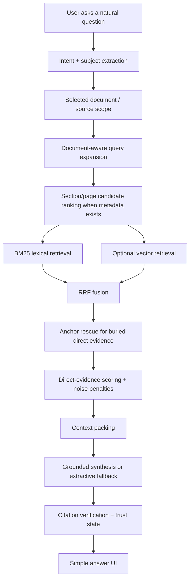

# NIRMIQ RAG Method

Last updated: 2026-07-10

## Chosen Method

NIRMIQ uses a custom **Evidence-First Hierarchical Hybrid RAG** method.

This is the best fit for the product because NIRMIQ must answer from student-owned academic material, work offline, stay useful on RTX 4050 and low-end Linux devices, and avoid exposing confusing retrieval controls to normal users.

## Why Not A Generic RAG Choice?

Pure vector RAG is not enough:

- It can retrieve semantically related but non-answering passages.
- It can miss exact textbook wording, formulas, headings, and OCR-damaged terms.
- It depends on embedding quality and vector-store availability.

Pure BM25 is not enough:

- It is strong offline and cheap, but misses synonym/acronym wording.
- It can over-rank index pages, glossaries, and broad list fragments.

GraphRAG is not the first move:

- A graph can help later for cross-document concept maps and paper synthesis.
- A graph database would add operational complexity before the core evidence problem is solved.
- MegaSprint One needs better direct evidence selection, not heavier infrastructure.

Agentic RAG is not the first move:

- Multiple agents can make demos look impressive while hiding retrieval weakness.
- NIRMIQ should first prove that one local pipeline can retrieve, verify, and abstain correctly.

## Pipeline

## Retrieval Layers

1. **Intent and subject extraction**

   The system detects whether the prompt is a definition, explanation, summary, comparison, paper-draft request, exam request, general chat, or unclear/unanswerable query.

2. **Document-scoped retrieval**

   If the user has an attached source, retrieval is scoped to that source first. This avoids unrelated corpus chunks leaking into the answer.

3. **Document-aware expansion**

   Query expansion is deterministic and local. It uses source terms, acronyms, headings, OCR variants, and academic wording patterns. It does not call a cloud model to rewrite queries.

4. **Section-first retrieval**

   When the document has section metadata, NIRMIQ ranks candidate chapters/sections/pages first, then retrieves chunks inside those regions.

5. **BM25 backbone**

   BM25 remains the offline baseline because it is fast, explainable, and works without Chroma, Ollama, or a GPU.

   For attached-source academic questions, the default `hybrid` request is internally routed to BM25-first retrieval unless the user explicitly asks for `vector`. This is based on the current real-world eval, where BM25 ranks textbook evidence more safely than vector-assisted hybrid.

6. **Optional vector support**

   Vector search is used as a helper in hybrid mode, not as the source of truth. Orphan vector hits are dropped unless SQLite confirms the chunk is still active.

7. **Anchor rescue**

   Legacy/no-section documents and OCR-heavy notes can bury direct answer paragraphs below broad lexical hits. Anchor rescue scans candidate text for high-directness cues such as definitions, exact phrases, release dates, privacy terms, dimensionality phrases, and answer-like passages.

8. **Direct-evidence scoring**

   Final chunks are judged against the original user query, not only the expanded query. This prevents expanded keywords from turning loosely related chunks into confident answers.

   In `megasprint1.v2`, candidate priority gives direct answer relevance enough weight to beat loose reranker/vector hits. This fixed selected-document questions where a related paragraph ranked above the actual answer passage.

9. **Noise penalties**

   Index, glossary, backmatter, broad application lists, copyright fragments, and corrupted OCR fragments are penalized for explanatory questions.

10. **Answer safety**

    If evidence is direct, NIRMIQ answers simply with paragraph citations. If evidence is weak, it says more evidence is needed. If the answer is not in the source, it abstains.

## Public UX Rule

The normal UI should show:

- The answer.
- A compact trust state: `Verified`, `Needs more evidence`, or `Not found in sources`.
- Citations only where they help the reader verify claims.

The normal UI should not show:

- BM25 scores.
- Vector scores.
- Chunk IDs.
- Token counts.
- Local file paths.
- Raw retrieval metadata.

## Current MegaSprint One Status

Implemented:

- Deterministic document-aware expansion.
- Textbook-aware section metadata.
- Section-first retrieval diagnostics.
- Direct-evidence scoring.
- Noise penalties for index/glossary/backmatter-like chunks.
- Anchor rescue for direct evidence buried in legacy/no-section documents.
- BM25-first internal routing for attached-source academic questions.
- Compact trust state and evidence-focused source inspection.

Latest verification:

| Eval | Mode | MRR | Recall@8 | Citation expected coverage |
| --- | --- | ---: | ---: | ---: |
| Query-category seed | BM25 | 0.950 | 1.000 | 1.000 |
| Query-category seed | Hybrid | 0.850 | 1.000 | 1.000 |
| Real-world academic seed | BM25 | 0.843 | 1.000 | 1.000 |
| Real-world academic seed | Hybrid | 0.804 | 1.000 | 1.000 |

MegaSprint One final tightening notes:

- Corrected two source-verified eval labels where OCR/wording damage hid valid evidence.
- Rebalanced candidate priority from `megasprint1.v1` to `megasprint1.v2` so direct answer relevance is stronger than a loose reranker hit.
- Rejected broader production OCR normalization because it lowered real-world MRR in trial runs.

Still active:

- More real-world eval labels from textbooks, notes, papers, and exam material.
- Better section detection for scanned PDFs and noisy OCR.
- Better answer shaping for broad conceptual questions.
- Measuring answer relevance, citation faithfulness, abstention correctness, latency, and memory use across query categories.

## Acceptance Targets

MegaSprint One's first reliability pass is complete on the current seed. It remains complete only if the harder real-world evaluation set stays above these thresholds as it grows:

- Recall@8: at least `0.850`.
- MRR: at least `0.700`.
- Expected citation coverage: at least `0.900`.
- Unsupported confident answers: trending toward zero.
- BM25-only mode remains usable without Chroma, Ollama, graph databases, or cloud APIs.

## Later Extensions

Only after Evidence-First Hierarchical Hybrid RAG plateaus:

- Add SQLite GraphRAG-lite for concept maps and paper synthesis.
- Add a small local reranker/verifier only if latency remains acceptable.
- Add richer multi-document source diversity for Paper Lab.
- Add NIRMIQ Mirror memory hooks after standalone academic RAG is reliable.
