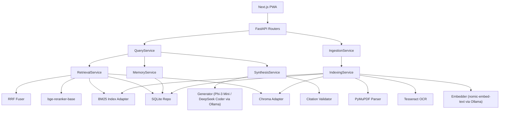

# NIRMIQ Academic Intelligence System — Phase 1 Foundational Architecture

Date: 2026-05-16
Scope: MVP foundation only (no advanced features)

## 1. Architecture Decisions (MVP)

### Core Principles
- Offline-first: all core paths run without internet.
- Single-process backend first: one FastAPI app with modular internal services.
- Retrieval quality over model size: stronger retrieval + rerank, smaller generation model.
- VRAM-aware orchestration: at most one heavy model active per request stage.
- Solo-dev maintainability: explicit boundaries, simple interfaces, minimal abstractions.

### Runtime Model Strategy (RTX 4050 focused)
- Embedding: `nomic-embed-text` via Ollama (CPU/GPU mixed acceptable).
- Rerank: `bge-reranker-base` (prefer CPU first; optional GPU toggle).
- Generation default: `Phi-3 Mini` (fast, low VRAM).
- Generation fallback for coding-heavy prompts: `DeepSeek Coder 6.7B` only when requested/routed.
- Do not co-run reranker + large generator on GPU by default.

## 2. Repository Structure

```text
Nirmiq-Academic-Intelligence-System/
├─ apps/
│  ├─ api/                              # FastAPI backend
│  │  ├─ pyproject.toml
│  │  ├─ app/
│  │  │  ├─ main.py                     # FastAPI entry
│  │  │  ├─ core/
│  │  │  │  ├─ config.py                # pydantic settings
│  │  │  │  ├─ logging.py
│  │  │  │  └─ deps.py                  # dependency wiring
│  │  │  ├─ api/
│  │  │  │  ├─ routers/
│  │  │  │  │  ├─ health.py
│  │  │  │  │  ├─ ingest.py
│  │  │  │  │  ├─ query.py
│  │  │  │  │  ├─ memory.py
│  │  │  │  │  └─ documents.py
│  │  │  │  └─ schemas/                 # request/response DTOs
│  │  │  ├─ domain/                     # pure business entities + policies
│  │  │  │  ├─ models.py
│  │  │  │  ├─ retrieval_policy.py
│  │  │  │  └─ citations.py
│  │  │  ├─ services/                   # orchestration layer
│  │  │  │  ├─ ingestion_service.py
│  │  │  │  ├─ indexing_service.py
│  │  │  │  ├─ retrieval_service.py
│  │  │  │  ├─ memory_service.py
│  │  │  │  ├─ synthesis_service.py
│  │  │  │  └─ query_service.py
│  │  │  ├─ adapters/                   # external libs + model adapters
│  │  │  │  ├─ storage/
│  │  │  │  │  ├─ sqlite_repo.py
│  │  │  │  │  └─ chroma_repo.py
│  │  │  │  ├─ parsing/
│  │  │  │  │  ├─ pymupdf_parser.py
│  │  │  │  │  └─ tesseract_ocr.py
│  │  │  │  ├─ retrieval/
│  │  │  │  │  ├─ bm25_index.py
│  │  │  │  │  ├─ rrf_fuser.py
│  │  │  │  │  └─ llamaindex_bridge.py
│  │  │  │  └─ llm/
│  │  │  │     ├─ ollama_client.py
│  │  │  │     ├─ embedder.py
│  │  │  │     ├─ reranker.py
│  │  │  │     └─ generator.py
│  │  │  ├─ pipelines/
│  │  │  │  ├─ ingest_pipeline.py
│  │  │  │  └─ query_pipeline.py
│  │  │  └─ tests/
│  │  │     ├─ unit/
│  │  │     ├─ integration/
│  │  │     └─ fixtures/
│  │  └─ alembic/
│  └─ web/                              # Next.js PWA (thin client)
│     ├─ package.json
│     ├─ app/
│     ├─ components/
│     ├─ lib/api-client.ts
│     └─ public/
├─ packages/
│  ├─ shared-schemas/                   # optional TS/Python contract snapshots
│  └─ prompt-templates/                 # prompt and response templates
├─ data/
│  ├─ raw/                              # user uploaded docs
│  ├─ processed/                        # cleaned text + chunks jsonl
│  ├─ indexes/
│  │  ├─ chroma/
│  │  └─ bm25/
│  ├─ sqlite/
│  │  └─ nirmiq.db
│  └─ cache/
├─ models/                              # optional local model manifests/config
├─ scripts/
│  ├─ bootstrap.ps1
│  ├─ run_api.ps1
│  ├─ run_web.ps1
│  └─ reindex.ps1
├─ docs/
│  ├─ phase1_foundational_architecture.md
│  ├─ api_contract.md
│  └─ retrieval_eval_plan.md
├─ .env.example
├─ docker-compose.local.yml             # optional local dev only
└─ README.md
```

## 3. Service Boundaries

### API Layer (`api/routers`)
- Responsibility: transport concerns only (HTTP validation, status codes).
- No retrieval logic in routers.

### Service Layer (`services`)
- `IngestionService`: document intake orchestration.
- `IndexingService`: chunking, embeddings, BM25 + vector index writes.
- `RetrievalService`: hybrid retrieval + rerank + citation packing.
- `MemoryService`: session/thread memory reads/writes and summarization.
- `SynthesisService`: grounded answer generation from packed context only.
- `QueryService`: end-to-end query lifecycle orchestrator.

### Adapters Layer (`adapters`)
- Concrete integrations with ChromaDB, SQLite, Ollama, PyMuPDF, OCR, LlamaIndex.
- Replaceable without touching domain/service logic.

### Domain Layer (`domain`)
- Policies:
  - retrieval budgets
  - citation constraints
  - hallucination guardrails (answer abstention thresholds)
- Pure models and scoring enums.

## 4. Ingestion Lifecycle

1. `POST /ingest` receives file metadata + path reference.
2. Store source file in `data/raw`.
3. Parse text via PyMuPDF.
4. OCR fallback only for low-text pages.
5. Normalize text (whitespace, headers, page anchors).
6. Chunk with deterministic strategy (token target + overlap).
7. Persist chunks in SQLite (`document_chunks`).
8. Embed chunks with `nomic-embed-text`.
9. Upsert embeddings into Chroma collection.
10. Build/update BM25 index for lexical retrieval.
11. Mark document `indexed` with version hash.

Notes:
- Idempotent by content hash.
- Re-ingestion creates new `index_version` and soft-disables old chunks.

## 5. Retrieval Lifecycle

1. Query normalization and intent tagging.
2. Memory fetch (session summary + recent turns).
3. Hybrid candidate retrieval:
   - BM25 top-K (lexical)
   - Chroma vector top-K (semantic)
4. Reciprocal Rank Fusion (RRF) merge.
5. Rerank fused top-N with `bge-reranker-base`.
6. Context compression:
   - deduplicate near-identical chunks
   - token-budget pack with diversity-by-document constraint
7. Citation map assembly (doc/page/chunk references).
8. Return grounded context bundle to synthesis.

## 6. Query Lifecycle (End-to-End)

1. `POST /query` receives user prompt + session id.
2. `QueryService` loads memory and retrieval policy.
3. `RetrievalService` returns ranked, cited context bundle.
4. `SynthesisService` prompts local generator with:
   - strict grounding instruction
   - supplied context only
   - citation-required response format
5. Post-generation guardrails:
   - verify citation anchors exist
   - confidence heuristics based on retrieval scores
   - abstain message if grounding weak
6. Persist turn in SQLite (`messages`) + memory update.
7. Return answer + citations + debug metadata (optional flag).

## 7. Database Schema (SQLite + Chroma)

### SQLite tables

#### `documents`
- `id` TEXT PK
- `source_path` TEXT UNIQUE
- `content_hash` TEXT
- `title` TEXT
- `mime_type` TEXT
- `status` TEXT (`uploaded|parsed|indexed|failed`)
- `created_at` DATETIME
- `updated_at` DATETIME

#### `document_chunks`
- `id` TEXT PK
- `document_id` TEXT FK -> documents.id
- `index_version` INTEGER
- `chunk_index` INTEGER
- `page_start` INTEGER
- `page_end` INTEGER
- `text` TEXT
- `token_count` INTEGER
- `chunk_hash` TEXT
- `is_active` BOOLEAN
- `created_at` DATETIME

#### `sessions`
- `id` TEXT PK
- `label` TEXT
- `created_at` DATETIME
- `updated_at` DATETIME

#### `messages`
- `id` TEXT PK
- `session_id` TEXT FK -> sessions.id
- `role` TEXT (`user|assistant|system`)
- `content` TEXT
- `citations_json` TEXT
- `retrieval_meta_json` TEXT
- `created_at` DATETIME

#### `memory_snapshots`
- `id` TEXT PK
- `session_id` TEXT FK -> sessions.id
- `summary` TEXT
- `window_start_msg_id` TEXT
- `window_end_msg_id` TEXT
- `created_at` DATETIME

#### `ingestion_jobs`
- `id` TEXT PK
- `document_id` TEXT FK -> documents.id
- `stage` TEXT
- `status` TEXT
- `error` TEXT
- `started_at` DATETIME
- `finished_at` DATETIME

### Chroma collections
- `chunks_v1`: embedding vectors keyed by `chunk_id`.
- metadata:
  - `document_id`
  - `index_version`
  - `page_start`
  - `page_end`
  - `chunk_hash`

## 8. Dependency Graph



## 9. Implementation Order (Incremental)

1. Project skeleton + settings + logging + health endpoint.
2. SQLite schema + migrations + repositories.
3. Document ingestion endpoint (upload metadata + raw file staging).
4. Parsing + chunking pipeline with deterministic chunk IDs.
5. Chroma embedding write path.
6. BM25 index write/read path.
7. Hybrid retrieval + RRF + reranker.
8. Query pipeline with grounded synthesis + citation formatting.
9. Session memory snapshotting.
10. Evaluation harness (offline retrieval precision checks).
11. Next.js minimal UI integration.
12. Performance pass (batch size, token budgets, model routing).

## 10. Tradeoffs and Why This Improves MVP Quality

- Single FastAPI app vs microservices:
  - Better for solo dev and offline reliability.
  - Tradeoff: less independent scaling (acceptable for MVP).

- Dual index (BM25 + vector):
  - Improves recall/precision across keyword-heavy and semantic queries.
  - Tradeoff: slightly higher ingestion cost.

- Rerank after RRF:
  - Reduces hallucination by improving relevance ordering.
  - Tradeoff: added latency; mitigated with small top-N budget.

- SQLite memory + metadata:
  - Simple, robust, debuggable local persistence.
  - Tradeoff: not horizontally scalable (not needed now).

- Strict citation enforcement in synthesis:
  - Improves groundedness and trust.
  - Tradeoff: occasional abstentions when retrieval is weak.

## 11. Minimal Dependency Map

- Backend:
  - `fastapi`, `uvicorn`, `pydantic-settings`
  - `sqlalchemy`, `alembic`
  - `chromadb`
  - `llama-index` (use focused modules only)
  - `pymupdf`, `pytesseract`, `Pillow`
  - `rank-bm25` (or lightweight BM25 implementation)
  - `httpx`, `orjson`
- Frontend:
  - `next`, `react`, `typescript`
  - PWA plugin + minimal client fetch wrapper

Keep optional:
- Heavy orchestration frameworks, queues, distributed tracing.

## 12. Phase 1 Exit Criteria

- Stable folder structure committed.
- Core schemas and service interfaces defined.
- SQLite schema migrated successfully.
- Ingestion and query pipelines designed and stubbed.
- No advanced features added (auth, cloud, multi-tenant).

## 13. Current Phase 1 Progress (Implemented)

- Functional local ingestion loop:
  - file validation
  - idempotent ingest by content hash
  - chunk versioning and deactivation
  - ingestion job status tracking
- Functional hybrid retrieval baseline:
  - BM25 lexical scoring (in-process)
  - optional Chroma vector retrieval when `chromadb` is installed
  - RRF fusion + lightweight rerank
  - optional Ollama-backed embedding/rerank with deterministic fallback
- Grounded query response path persists retrieval metadata and citations.
- Synthesis service now supports real Ollama generation with strict grounded prompting and fallback mode.
- Retrieval evaluation script available for Recall@K, MRR, and citation coverage.
- Session continuity now includes automatic memory snapshots from recent conversation windows.
- Ingestion now includes OCR fallback for low-text pages when OCR dependencies are available.
- Retrieval and synthesis limits are centralized in `RetrievalPolicy` and exposed via env config.
- Local web console now covers ingest, status, job history, retrieval mode selection, and memory display.

## 14. Phase 1 Complete

- The MVP foundation is in place and usable end-to-end.
- Phase 2 workflow polish is implemented with a document-centric console, citation jump links, document drilldown, and query/session comparison.
- Phase 3 is active with citation excerpts, source scores, answer diff visibility, and retrieval diversity tuning to tighten grounded reasoning feedback loops.
- Phase 4 is active with score-aware synthesis metadata and a compact grounding summary badge that keeps answer confidence visible at the point of query.
