# Recursive Document Summarization

Status: Remaining Job 2 implemented and locally verified on 2026-07-20.

## Purpose

Selected-document summary requests must cover the document rather than summarize only the highest-ranked retrieval passages. The implementation remains deterministic, offline, low-memory, and citation-faithful when Ollama, vectors, and reranking are unavailable.

## Flow

```mermaid
flowchart LR
    Q["Selected-document summary request"] --> A["Load all active chunks in document order"]
    A --> F["Filter unreadable front/back-matter noise"]
    F --> S["Map chunks into contiguous sections"]
    S --> C["Detect monotonic chapter and appendix boundaries"]
    C --> R["Recursively reduce section and chapter facts"]
    R --> O["Render overview and chapter guide"]
    O --> V["Verify paragraph citation coverage"]
    V --> K["Cache by content hash, query scope, and summarizer version"]
```

## Invariants

- Every readable source chunk is inspected in stable document order.
- Displayed facts retain their original chunk and page provenance.
- Front matter and a sustained late alphabetical-index region may be omitted from displayed facts, but the filtered count remains in debug hierarchy metadata.
- Missing chapter-heading extraction is disclosed as `heading unavailable`; chapter titles are not invented.
- Whole-document and scoped summaries have distinct cache keys.
- Changing `RECURSIVE_SUMMARY_VERSION` naturally invalidates stale summaries.
- The public `POST /query` request and top-level response shapes are unchanged.

## Measured Real-Textbook Smoke

Source: locally indexed 2,842-chunk machine-learning textbook. The source file remains untracked.

| Measure | Result |
| --- | ---: |
| Readable chunks inspected | 2,608 |
| Section groups summarized | 723 |
| Chapter/appendix groups | 22 |
| Late non-content chunks filtered | 619 |
| Citation coverage | 1.000 |
| First summary latency | 3.783 s |
| Cached summary latency | 0.191 s |

The preview retained Chapter 19 and Appendix D, disclosed the parser-missed Chapter 17 heading, and contained no detected alphabetical-index phrase used by the smoke gate.

## Tradeoffs

- Extractive output is less stylistically polished than an unconstrained model summary, but it is reproducible and source-faithful.
- Chapter titles can remain truncated when the PDF parser itself emits a truncated heading.
- The deterministic summary is a navigable document map, not a substitute for a human-authored abstract.
- Scoped requests such as `Summarize chapter 4` continue through query-focused RAG rather than the whole-document recursive path.

## Verification

- Focused recursive summary/citation/cache tests: `18 passed`.
- Full backend unit and integration suite: `238 passed`, one third-party warning.
- Ruff and Python compilation: passed.
- Next.js production build: passed at `118 kB` first-load JavaScript.
- Hard-document gate: `9/9`, MRR/Recall@8/citation coverage `1.000`.
- Strict offline academic gate: `40/40`, MRR `0.934`, Recall@8 `1.000`, citation coverage `1.000`, readability `0.985`, faithfulness `0.995`, answerability `1.000`.
