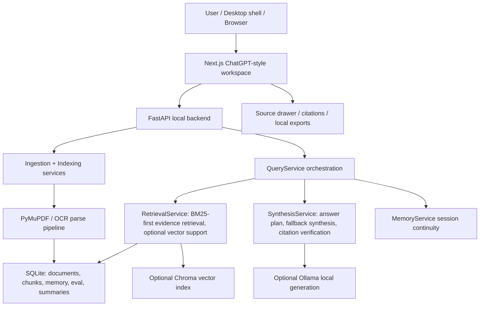

# NIRMIQ Review Sprints - 2026-07-24

Purpose: provide a grounded, multi-angle review of the current NIRMIQ Academic Intelligence project before the next requirements update.

Review baseline:

- Repository: `SheeshDarth/NirmiqResearchOS`
- Local branch: `main`
- Local HEAD: `31f663e` (`Record GitHub polish closure evidence`)
- Live CI checked: GitHub Actions run `29908325987`, successful on 2026-07-22
- Tracked repository size: `313` files
- Backend Python files: `102`
- Frontend app/component/public tracked files: `20`
- Existing untracked local file preserved: `deep-research-report.md`

## Executive Verdict

NIRMIQ is now a serious portfolio/demo MVP, not just a rough PDF chatbot. The architecture, offline contract, evaluation loop, CI, scripts, docs, desktop shell, and privacy controls all point in the right direction for an internship-grade GenAI/RAG project.

The product is not yet ready to be described as a production-grade arbitrary-document academic intelligence system. The main reasons are:

- The answer-quality metrics are strong, but the labeled corpus is still small relative to the promise of "any academic document".
- The retrieval and synthesis logic is concentrated in two large services, making future accuracy changes risky.
- The UI has improved toward a ChatGPT-like shell, but advanced controls still remain too close to the normal user path.
- Release evidence exists, but some release docs lag behind later MegaSprint Six metrics.
- Native Linux desktop packaging, signed Windows distribution, encrypted local storage, and large-scale noisy-document behavior remain unproven.

Overall status: **shippable as a local-first academic RAG portfolio/demo MVP; not yet a commercial production release.**

## Product Vision Understood

The intended product is:

> NIRMIQ Academic Intelligence: a local-first academic workspace where a student, researcher, or builder uploads their own documents, asks natural questions, receives simple source-backed answers, and opens citations only when they need verification.

The system should solve:

- Generic AI hallucinating over student material.
- Long PDFs exceeding normal chat context.
- Missing citations and unverifiable answers.
- Exam preparation from notes, textbooks, and question banks.
- Research-paper drafting with multiple local citations.
- Offline usage on consumer hardware, including RTX 4050-class systems and lower-end browser-mode Linux setups.

The desired interaction is:

```text
Open NIRMIQ
Upload or choose source
Ask naturally
Read a clear answer
Open Sources only when needed
Export or continue studying
```

The user should not need to understand BM25, vector search, RRF, reranking, chunk IDs, token counts, or raw retrieval metadata.

## Architecture Snapshot



## Failure Model

Most bad answers are not primarily caused by model size. They usually come from one of these stages:


Current mitigations include document-aware expansion, section-aware metadata, BM25-first routing, direct-evidence scoring, answer-used citations, citation verification, extractive fallback, and abstention when evidence is weak.

## Scorecard

| Area | Score | Verdict |
| --- | ---: | --- |
| Vision alignment | 8.6 / 10 | Strong direction; matches local academic intelligence better than a generic chatbot. |
| Offline-first contract | 9.1 / 10 | Core runtime works locally; cloud API is not required. |
| RAG reliability | 8.1 / 10 | Strong measured gains, but still limited by corpus size and real-world variety. |
| Answer presentation | 7.4 / 10 | Much better than earlier fragment scraping; still needs more human-readable educational style. |
| UI/UX simplicity | 7.0 / 10 | Chat-first shell exists, but advanced controls and panel complexity still leak into normal use. |
| Backend architecture | 7.3 / 10 | Service boundaries exist; retrieval/synthesis files are too large and heuristic-heavy. |
| Maintainability | 7.2 / 10 | Good docs/tests; large services and CSS will slow safe iteration. |
| Security/privacy | 7.8 / 10 | Local-first privacy posture is good; not a real auth/encrypted-vault system yet. |
| Performance/local runtime | 7.6 / 10 | BM25/offline path is sensible; long eval runtime and large documents need more budgets. |
| Release/GitHub polish | 8.5 / 10 | Strong repo polish, CI, scripts, screenshots; release manifest needs metric refresh. |
| Internship impact | 8.7 / 10 | Strong RAG/document-AI story if demo answers remain high-quality on unseen material. |

Weighted overall: **8.0 / 10**.

## Sprint 1 - Vision And Product Fit

Score: **8.6 / 10**

What is working:

- The product has a distinct reason to exist: source-grounded academic work, not a generic AI wrapper.
- The README explains the offline-first contract and says the local FastAPI backend is part of the runtime, not a cloud dependency.
- The workspace supports Research, Chat, Paper Lab, and Exam Lab without forcing a cloud account.
- The current language is honest about portfolio/demo MVP boundaries.

Primary gap:

- The product promise is broad: any document, exams, research papers, diagrams, noisy notes, low-end devices. The current proof is strong but narrower than that promise.

Recommendation:

- Keep the public promise precise: "offline-first academic document intelligence with measured local RAG" rather than "perfect answers for every academic document".

## Sprint 2 - Architecture And Backend Layering

Score: **7.3 / 10**

Evidence:

- `apps/api/app/services/retrieval_service.py`: `2262` lines.
- `apps/api/app/services/synthesis_service.py`: `4281` lines.
- `apps/api/app/services/query_service.py`: `729` lines.
- Public query schema remains stable in `apps/api/app/api/schemas/query.py`.
- API routes are clean and preserve `/api/v1/*` aliases.

What is working:

- FastAPI, SQLite, ingestion, retrieval, synthesis, memory, document, and exam services are separated at the service level.
- SQLite remains the reliable local source of truth.
- Chroma and Ollama are optional, not hard requirements.
- Runtime profiles support balanced, low-memory, and CPU-offline operation.

Architecture risks:

- `SynthesisService` now owns too many responsibilities: answer planning, local generation prompting, fallback writing, citation selection, claim verification, repair, summary formatting, exam formatting, and diagram handling.
- `RetrievalService` owns too many ranking paths and rescue heuristics in one file.
- Future accuracy work could become fragile because a small scoring change may affect definitions, summaries, procedures, Paper Lab, and Exam Lab together.

Recommended next architecture split:

- `AnswerPlanner`: intent, subject, obligations, answer contract.
- `EvidenceRetriever`: BM25/vector/section candidate retrieval.
- `EvidenceRanker`: directness, obligation fit, noise penalties, source diversity.
- `ContextPacker`: token budget and answer-used citation mapping.
- `CitationVerifier`: support audit, claim repair decision.
- `FallbackComposer`: deterministic source-only answer templates.

Keep the public API unchanged while extracting these modules behind `QueryService`.

## Sprint 3 - RAG Accuracy And Evaluation

Score: **8.1 / 10**

Current measured evidence:

| Eval | Samples | Mode | MRR | Recall@8 | Citation coverage | Answer quality |
| --- | ---: | --- | ---: | ---: | ---: | ---: |
| Demo retrieval | 30 | hybrid | 0.983 | 1.000 | 1.000 | retrieval-only |
| Demo retrieval | 30 | BM25 | 0.983 | 1.000 | 1.000 | retrieval-only |
| Real-world answer quality | 40 | BM25 | 0.934 | 1.000 | 1.000 | 0.940 overall |
| Hard-document gate | 9 | BM25 | 1.000 | 1.000 | 1.000 | 0.974 overall |
| Recursive summary reliability | 3 cases | deterministic | n/a | n/a | 1.000 support | passed |

Additional quality signals:

- Real-world answer-quality pass rate: `1.000`.
- Real-world answer relevance: `0.827`.
- Real-world concept coverage: `0.831`.
- Real-world query focus: `0.816`.
- Real-world faithfulness: `0.995`.
- Hard-document query focus: `0.767`.
- Hard-document diagram concept coverage: `0.750`.

What is working:

- The previous failure mode of keyword-fragment scraping has been significantly reduced on the current labeled data.
- BM25-first local retrieval is currently the safest offline backbone.
- Answer-used citation scoring is the right metric direction.
- Abstention behavior is measured and working for the current unanswerable cases.

Main RAG limitation:

- The strongest metrics are on a controlled set. They do not yet prove behavior across unseen textbooks, lecture notes, slide decks, handwritten notes, scanned PDFs, formulas, tables, and diagrams.

High-priority next RAG work:

- Expand real-user QA into reviewed eval labels.
- Add 100-150 unseen natural queries across at least 5 source types.
- Track query category scores separately, especially definitions, mechanisms, procedures, summaries, enumerations, diagrams, and unanswerable prompts.
- Add human-rated answer helpfulness alongside automatic retrieval metrics.
- Keep BM25 as default, and only add GraphRAG-lite or a reranker if metrics justify it.

## Sprint 4 - UI/UX And Interaction Complexity

Score: **7.0 / 10**

Evidence:

- `apps/web/app/page.tsx`: `1588` lines.
- `apps/web/app/page-model.ts`: `564` lines.
- `apps/web/app/globals.css`: `3341` lines.
- Components exist for composer, thread, empty state, local login, source panel, answer body, and header.
- `chat-composer.tsx` includes collapsed composer, upload, source actions, and advanced routing under `More`.

What is working:

- The UI is now more chat-first than earlier dashboard versions.
- Upload is available from the composer.
- Sources are on demand instead of always crowding the screen.
- Metadata is mostly hidden from the default reading path.
- The first-run/login card explains local profile, offline core, citation trail, and academic workflows.

UX risks:

- `More` still exposes `Advanced routing`, thread IDs, retrieval modes, and retrieval profiles. This can confuse normal users even though it is collapsed.
- Four workspace modes still need exceptionally clear microcopy so users know when to use Research, Chat, Paper Lab, and Exam Lab.
- The CSS file is large enough that visual regressions may become hard to control.
- Existing screenshots may not fully reflect the newest simplified shell and should be refreshed when the UI stabilizes.

Recommended UX principle:

> Normal users should only see Ask, Attach, Sources, Export, and Workspace. Retrieval controls should become developer-only.

## Sprint 5 - Security And Privacy

Score: **7.8 / 10**

What is working:

- API binds locally by default.
- CORS is restricted to configured local origins.
- Request body limits are enforced.
- Security headers include `X-Content-Type-Options`, `X-Frame-Options`, `Referrer-Policy`, and `Permissions-Policy`.
- HSTS and CSP are available as production opt-in toggles.
- Arbitrary local-path ingestion is disabled by default through `SECURITY_ALLOW_ARBITRARY_LOCAL_PATHS=false`.
- Diagnostics are designed to exclude prompts, answers, raw logs, document text, databases, full local paths, and user-home paths.
- Local data purge/reset controls exist.

Security boundaries:

- The login page is a local profile gate, not real authentication.
- Profile details are stored in browser `localStorage`.
- There is no encrypted local vault yet.
- Hosted multi-user auth is explicitly out of scope.
- CI enables arbitrary local paths for isolated tests, which is acceptable only because test roots are controlled.

Recommended next security work:

- Add a visible in-app privacy note saying local profile is not account security.
- Add optional encrypted local vault design only if the user wants commercial distribution.
- Keep diagnostics redaction tests mandatory.
- Move raw local file paths to debug-only surfaces.

## Sprint 6 - Performance And Local Runtime

Score: **7.6 / 10**

What is working:

- BM25-only mode remains available without Chroma, Ollama, reranker, or cloud APIs.
- Runtime profiles support `balanced`, `low_memory`, and `cpu_offline`.
- Low-memory defaults reduce context size, prediction length, and embedding batch size.
- Linux browser-mode offline smoke is covered by CI.
- The web first-load bundle is documented at about `118 kB`.

Known performance debt:

- The strict 40-case eval previously improved from `310.8s` to `274.3s`, but this is still long for frequent local iteration.
- Performance budgets are reported but not fully enforced.
- Large textbooks with thousands of chunks will continue stressing ranking, context packing, and source drawer usability.
- Native Linux desktop packaging is unverified.

Recommended next performance work:

- Add stage-level latency logging for parse, indexing, retrieval, synthesis, citation verification, and UI response.
- Enforce advisory budgets in release checks without failing on hardware variance yet.
- Add corpus reuse for evals to avoid full rebuild cost.
- Keep reranker off by default until it proves value on local hardware.

## Sprint 7 - Release, GitHub, And Portfolio Readiness

Score: **8.5 / 10**

What is working:

- README has badges, architecture image, reviewer snapshot, local setup, Docker notes, Linux notes, security links, and honest release boundaries.
- GitHub Actions includes Windows backend/web/eval checks and Linux browser-mode offline smoke.
- Screenshots are tracked under `docs/assets`.
- One-command scripts exist for startup, doctor, ship check, desktop, smoke, eval, diagnostics, and QA export.
- GitHub issue templates, PR template, CODEOWNERS, LICENSE, CONTRIBUTING, and SECURITY are present.

Release gap:

- `docs/release_manifest_v0.5.md` still contains older strict 40-case metrics (`MRR 0.868`, `Recall@8 0.921`) while later README/context/MegaSprint Six records show stronger final metrics. This should be reconciled before public sharing.

Recommended release polish:

- Refresh release manifest or create a new `release_manifest_v0.6.md`.
- Capture new screenshots/GIF after the final UI pass.
- Add a short `2-minute demo script` section to the README top third.
- Keep "what works now" and "what is planned" strict and honest.

## Findings By Severity

### P1 - Strong Metrics, Limited Generalization Proof

The current metrics are strong, but they are not yet enough to prove arbitrary-document accuracy. The next version should expand unseen eval data before making broad claims.

Impact: possible public demo failure if a reviewer uploads a new textbook or asks a natural question outside the tuned coverage.

Recommended fix: add 100-150 reviewed, query-agnostic labels across multiple document types and preserve a blind holdout set.

### P1 - Retrieval And Synthesis Services Are Too Large

`RetrievalService` and `SynthesisService` have become central reasoning engines with thousands of lines. This is understandable after many rescue passes, but it raises regression risk.

Impact: future RAG improvements may overcorrect one query category and harm another.

Recommended fix: extract answer planning, evidence ranking, citation verification, and fallback composition into smaller modules with category-specific tests.

### P2 - Advanced Controls Still Leak Into Normal UX

The UI is calmer now, but ordinary users can still encounter thread IDs, retrieval mode, and retrieval profile inside composer menus.

Impact: makes the product feel less like ChatGPT and more like a developer RAG workbench.

Recommended fix: move advanced controls into a developer/debug drawer, hidden behind an explicit developer mode.

### P2 - Release Manifest Is Stale Compared To Later Metrics

The release manifest still records older answer-quality numbers.

Impact: recruiters or reviewers may see inconsistent proof across docs.

Recommended fix: create `release_manifest_v0.6.md` or update the manifest after the next verified release gate.

### P2 - Human Evaluation Is Still Young

The real-user QA export loop exists, but the project needs more natural, unseen questions from actual users.

Impact: automated metrics can look better than real perceived usefulness.

Recommended fix: run 10-20 questions per major source and convert only reviewed failures into eval labels.

### P3 - Local Profile Is Not Authentication

The login/profile page improves onboarding, but it is not a security boundary.

Impact: users may overestimate privacy/security if not clearly messaged.

Recommended fix: keep copy explicit: local profile only, no cloud account, not encrypted auth.

## Metrics To Keep Tracking

Retrieval:

- Recall@3, Recall@5, Recall@8, Recall@20.
- MRR.
- nDCG@3 and nDCG@8.
- Source diversity for multi-document Paper Lab.
- Direct-evidence hit rate by query category.

Answer quality:

- Answer relevance.
- Concept coverage.
- Query focus.
- Readability.
- Faithfulness.
- Answerability correctness.
- Unsupported confident answer rate.
- Citation support coverage.

Runtime:

- Indexing latency per page and per chunk.
- Retrieval latency.
- Synthesis latency.
- Citation verification latency.
- Summary cache hit rate.
- Peak memory during ingestion/eval.

UX:

- Time to first successful answer.
- Number of visible controls in normal mode.
- Source drawer open rate.
- Feedback ratio: `Good` vs `Needs work`.
- Mobile/laptop scroll success.

Release:

- CI latest run conclusion.
- Desktop smoke result.
- Linux browser-mode smoke result.
- Ship-check result.
- Screenshot/GIF freshness.

## Alignment With The Vision

NIRMIQ currently aligns well with the core vision:

- Local-first: yes.
- Offline-capable: yes.
- Academic document focus: yes.
- Source-grounded answers: yes, on measured corpora.
- ChatGPT-like UX: partially; direction is right, but normal mode still needs more hiding/simplification.
- Paper Lab: foundation exists, but source-diversity and export polish should deepen.
- Exam Lab: foundation exists, but custom PDF and diagram-rich answers need more real testing.
- Low-hallucination: improved, but dependent on evidence precision and eval expansion.
- Internship-grade project: yes, if presented honestly with measured evidence and a live demo.

## Recommended Next Requirements For The Updated Version

1. **RAG generalization gate**

   Grow the eval set to at least 100-150 reviewed queries across unseen textbooks, lecture notes, papers, slides, scans, diagrams, formulas, tables, and unanswerable prompts.

2. **Backend reasoning refactor**

   Split `RetrievalService` and `SynthesisService` into smaller modules while keeping the public API stable.

3. **Developer-mode separation**

   Remove retrieval/profile/thread controls from normal composer UX. Keep them available only in an explicit developer drawer.

4. **Answer style upgrade**

   Make answers more educational: short answer, simple explanation, example, why it matters, limitations, and citations only where useful.

5. **Release v0.6 evidence**

   Create a new release manifest after running ship checks, CI, desktop smoke, Linux browser smoke, and the expanded eval gate.

6. **Source preview polish**

   Clicking a citation should open a clean source preview with only page, excerpt, and why this source supports the paragraph.

7. **Privacy trust polish**

   Make the local-only privacy model visible in-app without pretending there is real account auth or encryption.

8. **Performance budgets**

   Add non-flaky budget reporting for retrieval, synthesis, and eval runtime. Enforce only after stable baselines are collected across machines.

## Do Not Do Yet

- Do not add cloud APIs as a core dependency.
- Do not add a heavy graph database before evidence retrieval plateaus.
- Do not add multi-agent orchestration to mask retrieval weakness.
- Do not claim commercial production readiness.
- Do not tune only the current 40 cases.
- Do not add more visible controls for normal users.

## Final Review Position

NIRMIQ is moving in the correct direction. The core idea is strong, the current implementation is measurable, and the latest metrics show real progress. The next version should focus on making the measured reliability survive unseen documents and making the UI feel almost invisible: one calm chat surface, one attach button, one source drawer, and answers that feel like a thoughtful academic assistant rather than retrieved fragments.
