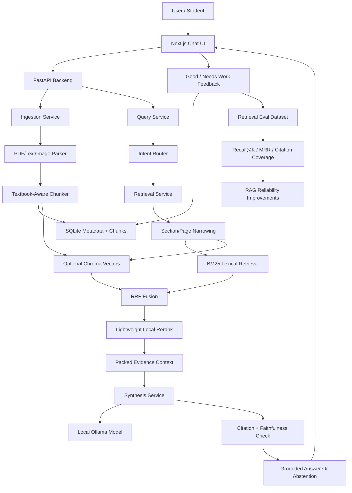

# Problems Faced And RAG Reliability Roadmap

Last updated: 2026-07-09

This is the canonical engineering problem log for NIRMIQ ResearchOS. It documents what has failed, what is still failing, what may fail later, and how the next RAG Reliability Phase should resolve the core retrieval and hallucination issues.

The main conclusion is simple:

> The model hallucinates mostly because retrieval is not yet precise enough on large academic documents. If the right evidence does not enter context, the local model is forced to guess.

## 2026-07-09 MegaSprint One Reliability Update

Reduced:

- Moved from mandatory prompt-specific regression thinking to query-category evaluation.
- Added source-aware query expansion for acronyms and document terminology.
- Added direct-evidence scoring so loose keyword matches do not become confident answers.
- Strengthened penalties for index, glossary, backmatter, and broad example-list passages during explanatory questions.
- Simplified normal trust language to `Verified`, `Needs more evidence`, and `Not found in sources`.
- Hid scores, chunk ids, token counts, and reliability-gate internals from the normal UI.

Still active:

- Grow the query-category eval seed with real textbook, notes, research-paper, exam, and unanswerable labels.
- Improve visual/diagram answers using extracted diagram metadata and captions only.
- Continue section/page-first retrieval tuning before adding heavier graph databases or agent layers.

## Architecture Diagram

## Current Retrieval Baseline

The harder real-world seed evaluation currently shows:

- BM25 MRR: approximately `0.578`.
- BM25 Recall@8: approximately `0.750`.
- Expected citation coverage: approximately `0.750`.

After the first reliability slice:

- BM25 MRR: approximately `0.781`.
- BM25 Recall@8: approximately `0.875`.
- Expected citation coverage: approximately `0.875`.

The first slice added deterministic query expansion, normalized eval matching, and retrieval noise penalties. It reached the initial MRR and Recall@8 targets on the current 16-sample real-world seed, but citation coverage still needs to reach at least `0.900` on a larger eval set.

Interpretation:

- NIRMIQ is useful, but not yet reliable enough for arbitrary textbook-grade academic Q&A.
- Roughly one in four expected evidence cases may be missing within the top retrieved candidates.
- Hallucination risk rises when answer-bearing chunks are absent, too broad, or buried below the context cutoff.

## Past Problems Faced

### Ingestion And Parsing

- Some PDFs could not be ingested from arbitrary local paths due to local-path safety restrictions.
- Messy PDFs produced noisy chunks with headers, footers, glyph corruption, boilerplate, or broken text.
- Low-text or scanned pages required OCR fallback planning.
- Empty-text reindex attempts risked wiping useful prior chunks before the safe reindex guard was added.
- Uploaded files needed safer type and readability validation.

### Indexing And Storage

- Chroma vector collections could retain stale embedding dimensions or stale chunk metadata.
- Vector-only hits could point to chunks SQLite no longer considered active.
- Document deletion and purge needed to clear derived artifacts consistently.
- SQLite schema had to grow over time for summaries, exam artifacts, diagrams, and answer feedback without becoming overbuilt.

### Retrieval

- Early retrieval returned related chunks rather than exact answer-bearing chunks.
- BM25 lexical matching struggled when user wording did not match textbook wording.
- Optional vector retrieval improved some semantic cases but introduced inconsistency when embeddings were disabled or unavailable.
- RRF and lexical reranking helped ordering but did not solve section awareness.
- BM25 is currently rebuilt from active chunks per query, which is simple but inefficient for large textbooks.
- Large documents with many chunks expose weak chapter, section, heading, and page hierarchy awareness.

### Synthesis And Hallucination

- Generated answers could attach citation anchors to claims not fully supported by the cited chunk.
- Citation coverage initially measured anchors, not full faithfulness.
- Broad document questions could receive dense chunk dumps instead of readable answers.
- Long-context generation can drift when retrieval is weak or when temperature is higher for drafting modes.
- Local models can produce empty or weak generations when Ollama models are missing, slow, or unsuitable.

### UI And Workflow

- Earlier UI iterations were too dashboard-like, crowded, and confusing.
- Too much debug metadata made users distrust the product instead of helping them understand answers.
- Composer height and scrolling sometimes reduced answer readability.
- Source/citation panels needed to be available but not constantly visible.
- The app needed a clearer ChatGPT-style primary workflow: upload, ask, read, inspect sources only when needed.

### Runtime And Testing

- Next.js dev preview had stale chunk/hydration problems after rebuilds.
- Windows test temp folders could become locked and cause pytest `PermissionError`.
- Desktop startup needed better local runtime diagnostics.
- Low-memory local model settings had to be bounded for RTX 4050-class hardware.

## Problems We Are Facing Now

### 1. Textbook Retrieval Precision Is Still Too Low

Large academic documents are not just long text files. They contain chapters, sections, definitions, examples, tables, figures, captions, exercises, and references. Current retrieval still treats many documents too much like flat chunks.

Impact:

- Relevant answer sections may be missed.
- Broad overview chunks may outrank exact concept chunks.
- Answers can become vague, incomplete, or overly generic.

### 2. Hallucination Is Mostly A Retrieval Precision Problem

When retrieved context is weak, the model tries to bridge gaps. Citation verification can catch some unsupported claims, but it cannot recover evidence that retrieval never found.

Impact:

- The model may answer from general ML knowledge rather than the selected textbook.
- Citations may appear trustworthy even when support is partial.
- Users may receive plausible but incomplete answers.

### 3. BM25 Rebuild Cost Limits Scale

The current BM25 adapter rebuilds token statistics from active chunks per query. This keeps the MVP simple and safe, but it is inefficient as document counts and chunk counts increase.

Impact:

- Larger textbooks feel slower.
- Multi-document corpora become more expensive to query.
- Retrieval behavior is harder to optimize globally.

### 4. Optional Semantic And Rerank Paths Create Quality Variance

The system can run BM25-only, hybrid, vector, and optional reranker paths. This is good for offline fallback, but output quality can vary across runtime modes.

Impact:

- A feature may look good on a machine with embeddings/reranker available and weaker on a low-end or offline-only setup.
- Demo reliability depends on knowing which retrieval mode is active.

### 5. Eval Data Is Still Too Thin

The demo eval set is useful, and the real-world seed set is harder, but the project needs more labels from actual textbooks, notes, papers, and exam material.

Impact:

- Changes can appear better from anecdotal testing but fail on other academic material.
- There is not enough evidence yet to claim broad textbook reliability.

## Future Risks

- Many-book scaling may make flat retrieval and query-time BM25 too slow.
- Large PDFs may produce noisy parse output that pollutes retrieval.
- Low-end Linux devices may need BM25/extractive-first behavior without Ollama or Chroma.
- Heavy graph databases could overcomplicate the solo-developer MVP.
- Cloud embeddings or connected model modes could compromise the local-first privacy promise if added carelessly.
- Bigger local models could increase VRAM pressure without fixing weak retrieval.
- Agentic retrieval could add complexity before baseline retrieval is measurable.
- UI trust badges could overpromise if users interpret them as full proof rather than retrieval-support indicators.

## Root Causes

- Flat chunking lacks strong chapter and section hierarchy.
- Retrieval does not yet narrow to likely sections/pages before ranking chunks.
- Query expansion is mostly deterministic and limited.
- Lexical matching misses synonyms, acronyms, and textbook-specific phrasing.
- Vector recall depends on local embedding availability and quality.
- Lightweight reranking is not enough for all paraphrased academic questions.
- Citation verification is lexical, not full semantic entailment.
- Feedback data is new and has not yet been converted into gold eval labels.

## What Has Worked

- Local-first FastAPI and Next.js architecture is stable enough for MVP work.
- SQLite is effective for metadata, chunks, sessions, summaries, exam profiles, diagrams, and feedback.
- BM25 baseline is reliable and offline-friendly.
- Optional Chroma vectors provide a path for semantic recall without making cloud APIs mandatory.
- RRF fusion and reranking hooks provide an extensible retrieval pipeline.
- Citation coverage and faithfulness checks reduce unsupported-answer risk.
- Extractive fallback is safer than forcing generation when evidence is weak.
- Local answer feedback now captures real failure cases through `Good` and `Needs work`.
- Golden demo and real-world eval scripts make retrieval quality measurable.

## 2026-06-26 First Reliability Slice Implemented

Implemented before the next metric run:

- Added SQLite `document_sections` metadata.
- Added nullable chunk metadata for `section_id`, `heading`, `section_path`, `chunk_type`, and `key_terms_json`.
- Added lightweight textbook heading and section detection during indexing.
- Added metadata-aware BM25 search text so headings and key terms influence lexical retrieval.
- Added selected-document section-first retrieval when section metadata matches the query.
- Added debug-only `retrieval_meta` fields:
  - `section_candidates`
  - `section_first_enabled`
  - `chunk_selection_reasons`
  - `retrieval_diagnostics`
- Added unit/integration tests for section detection, metadata persistence, and retrieval diagnostics.

Current caveat:

- This is the first precision layer, not the finished reliability target. The next step is to rerun demo and real-world evals, promote `Needs work` feedback into labels, and tune against measured failures.

## 2026-07-06 Deep Research Review And Evidence Gate

What the deep research report got right:

- NIRMIQ should use Adaptive Evidence-Grounded Hybrid RAG, not plain RAG and not always-on GraphRAG.
- Lite mode should be BM25/extractive-first with strict abstention.
- Edge mode can use hybrid retrieval when it proves value.
- Pro mode can add background graph reasoning later.
- Generated summaries and answers must remain derived artifacts, never first-class truth.

Failure discovered:

- Real-world eval initially failed with `no such column: section_id`.
- Root cause: legacy SQLite databases tried to create a section index before additive section columns were applied.
- Fix: run additive chunk-column migrations before index creation.

Evaluation correction:

- Full-query eval was scoring expected evidence against truncated UI citation excerpts.
- That made citation expected coverage appear to be `0.3125`.
- After using full cited chunk text, corrected full-query citation expected coverage is `0.6875`.

Implemented:

- Legacy SQLite migration regression test.
- Full cited-chunk scoring in `scripts/eval_retrieval.py`.
- Evidence reliability gate in `SynthesisService`.
- Line-aware citation coverage so headings/question labels are not counted as claims.
- Cleaner extractive fallback wording so wrapper text is not falsely cited.

Remaining problem:

- Full-query coverage (`0.688`) still trails raw retrieval coverage (`0.750`).
- BM25 still beats hybrid on the real-world seed.
- The next reliability work is answer-used citation selection, eval expansion, and hybrid/BM25 routing, not GraphRAG.

## RAG Reliability Phase Roadmap

### Phase A: Freeze Baseline

- Preserve current retrieval metrics before changing behavior.
- Run demo and real-world eval scripts.
- Record Recall@8, Recall@20, MRR, expected citation coverage, latency, and failure examples.
- Use current metrics as the before-state for GitHub and portfolio reporting.

### Phase B: Convert Feedback Into Eval Labels

- Review saved `Needs work` answer feedback.
- Convert repeated failures into labeled eval cases.
- Add expected pages, chunks, or phrases where possible.
- Include answerability labels so the system learns when to abstain.

### Phase C: Textbook-Aware Metadata

- Enrich chunks with chapter, section, heading, page range, key terms, definitions, captions, and nearby context.
- Preserve stable chunk IDs and source references.
- Store metadata in SQLite before considering graph databases.
- Keep backwards compatibility with existing chunks.

### Phase D: Section-First Retrieval

- Retrieve likely chapters, sections, or page regions first.
- Search chunks inside those narrowed regions.
- Keep BM25 + optional vector retrieval + RRF fusion.
- Add diagnostics explaining why each chunk was selected.

### Phase E: Local Query Expansion

- Expand queries using local document metadata only.
- Use headings, glossary-like terms, acronyms, aliases, and prior successful feedback phrases.
- Keep expansions visible in debug metadata but hidden from normal UI.
- Avoid broad LLM-generated query expansion until measured retrieval improves.

### Phase F: Lightweight Reranking

- Rerank only the top 20-40 candidates.
- Prefer a low-memory local reranker or improved lexical/embedding rerank.
- Do not co-run a heavy reranker and large generator on limited VRAM by default.

### Phase G: Failure-Aware Answering

- If evidence coverage is weak, retrieve more targeted context or abstain.
- If citations do not cover claims, rewrite extractively.
- If the query is broad and evidence is partial, answer only the supported part and say what is missing.
- Do not fix hallucination by simply increasing model size, temperature, or context length.

## Acceptance Targets

The next reliability phase should aim for:

- Recall@8: at least `0.850`.
- MRR: at least `0.700`.
- Expected citation coverage: at least `0.900`.
- Stable local runtime on RTX 4050-class hardware.
- Usable BM25-only fallback for low-end/offline devices.

## What Not To Do First

- Do not add TigerGraph, Neo4j, or another graph server before SQLite GraphRAG-lite is measured.
- Do not add cloud embeddings as a default path.
- Do not increase context length to mask weak retrieval.
- Do not rely on prompt-only fixes for retrieval failures.
- Do not make the UI expose every retrieval parameter to normal users.
- Do not claim production-grade academic accuracy until the real-world eval set is larger.

## Next Documentation Links

- `README.md` should link to this file as the engineering problem log.
- `context.md` should record this as the start of the RAG Reliability Phase.
- `docs/accuracy_precision_audit.md` should reference this file as the canonical problem-and-roadmap source.
- Future implementation commits should update this file whenever a major problem is fixed, deferred, or newly discovered.
