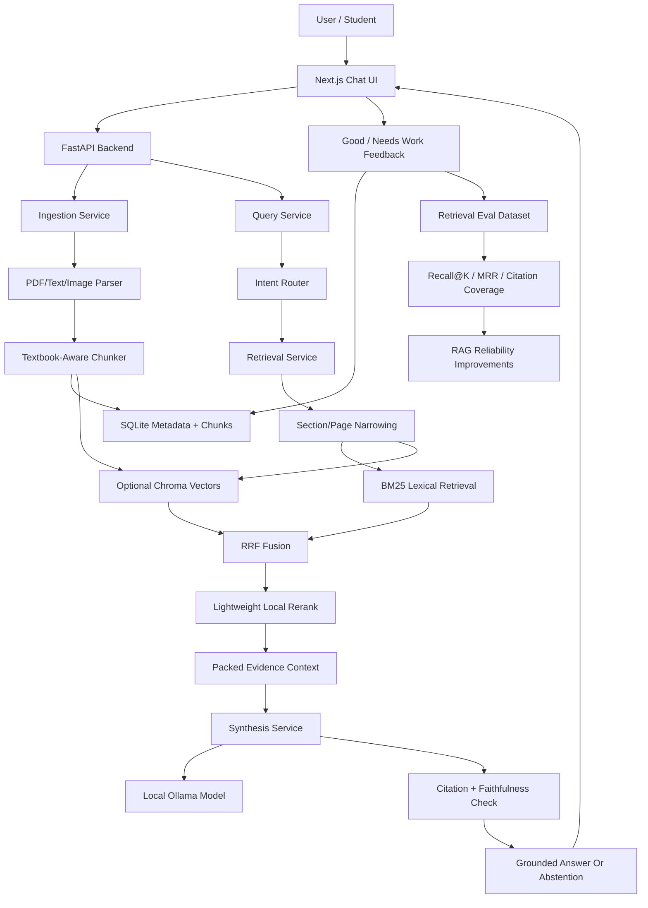

# Problems Faced And RAG Reliability Roadmap

Last updated: 2026-07-21

This is the canonical engineering problem log for NIRMIQ ResearchOS. It documents what has failed, what is still failing, what may fail later, and how the next RAG Reliability Phase should resolve the core retrieval and hallucination issues.

The main conclusion is simple:

> The model hallucinates mostly because retrieval is not yet precise enough on large academic documents. If the right evidence does not enter context, the local model is forced to guess.

## 2026-07-21 Remaining Job 4 Runtime Pressure

Resolved for the first Job 4 block:

- BM25 no longer retokenizes the same selected-document corpus for every query in a
  single process.
- The retriever can reuse selected-document active chunks and sections when the document
  manifest is unchanged.
- Evaluator output now records runtime, cache counters, and slowest samples so speed work
  has evidence instead of anecdotes.

Measured result: the strict BM25-only 40-case full-query gate remained `40/40` and local
runtime moved from the recorded `310.8s` baseline to `274.3s`. The final telemetry run
reported selected-document row cache `37` hits / `3` misses and BM25 corpus cache `37`
hits / `3` misses / `0` evictions.

Still open:

- The strict gate is still slow for quick development loops.
- Caches are process-local; they do not persist tokenized BM25 state across restarts.
- The next likely hotspots are answer orchestration, section/directness scoring, and
  repeated candidate inspection.
- Hardware-sensitive latency budgets should remain advisory until Windows, Linux, and
  low-end profiles are measured separately.

Canonical Job 4 record: [`docs/eval_runtime_optimization.md`](docs/eval_runtime_optimization.md).

## 2026-07-21 Remaining Job 5 Linux Validation Boundary

Resolved for browser-preview mode:

- Added an Ubuntu CI smoke that builds the web app on Linux, starts the local FastAPI API,
  ingests a local markdown source, and verifies a grounded BM25 answer with citations.
- The smoke disables Ollama generation, embeddings, reranking, vector search, and cloud
  dependencies to prove the low-end path.
- Local Git Bash syntax validation passed; a local HTTP smoke of the same offline path
  returned a grounded cited answer.

Still open:

- Native Linux desktop packaging is not validated.
- ARM Linux and very small RAM devices remain untested.
- OCR-heavy/scanned Linux workflows need separate coverage because this smoke deliberately
  avoids Tesseract and proves the lowest-memory text path.

Canonical Job 5 record: [`docs/linux_runtime_validation.md`](docs/linux_runtime_validation.md).

## 2026-07-20 Remaining Job 3 Reliability Closure

Resolved for the recursive selected-document summary path:

- Adversarial structure fixtures now challenge contents/index noise, duplicate OCR
  headings, mojibake, false chapter references, equations, tables, diagrams, and
  limitations.
- Citation presence is no longer the only summary trust check. Each cited claim sentence
  is compared with its cited excerpt and invalid anchors are counted.
- Cache hits validate the current recursive-summary version and citation support before
  returning cached content.
- Determinism, wall-clock latency, and Python allocation peak are now part of a local
  repeatable gate.

Measured result: `3/3` adversarial cases passed with citation-support coverage `1.000`,
zero invalid anchors, zero unsupported cited sentences, and deterministic output. This
does not prove semantic entailment or arbitrary-PDF accuracy; it closes the specific
Job 3 regression surface and moves the next risk to independent real-user documents.

Final Job 3 closure added selected-document scope validation for cache hits. This prevents
an active chunk from another document from being accepted merely because its text and
cache metadata look valid. The final council unanimously approved closure after this
fix, and Job 4 is now the next sprint.

## 2026-07-19 MegaSprint Six Reliability Closure

Resolved on the current 40-case offline benchmark:

- Broad lexical overlap no longer counts as sufficient evidence by itself. Each query is converted into required and optional evidence obligations.
- Comparisons require direct evidence for each named side; nearby labels, headings, and figure captions are not accepted as definitions.
- Mechanism questions require the requested operation and result, while interpretation questions require complete value-to-meaning mappings.
- Required obligations receive bounded independent BM25 searches, local subject-relevance scoring, and preservation through final candidate selection.
- Long early chunks no longer monopolize synthesis context; bounded excerpts are packed across up to 12 candidates without increasing the total token budget.
- Deterministic fallbacks are shaped by the requested answer type and use only source evidence. Missing required evidence produces abstention rather than confident filler.
- Selected-document summaries receive representative source chunks across sections or page spans.

Measured result:

- Strict offline BM25 full-query benchmark: MRR `0.921`, Recall@8 `1.000`, expected citation coverage `1.000`.
- Answer-quality pass: `40/40`; readability `0.985`; faithfulness `0.995`; answerability correctness `1.000`.
- The canonical failure log is empty for this labeled set.

Still open:

- The 40 cases do not cover arbitrary documents. Scans, handwriting, equations, tables, diagrams, and additional textbooks remain required evaluation work.
- Hierarchical summary seeds improve whole-document coverage, but full recursive chapter summarization is not implemented.
- BM25 is deliberately retained as the reliable low-memory backbone; optional semantic retrieval must beat it on unseen data before becoming authoritative.
- Further tuning against the same 40 labels is paused to avoid overfitting.

## 2026-07-19 Resolved: Hard Files Passed Parsing But Lost Their Answer

Symptoms:

- OCR support could appear available even when no working Tesseract executable existed.
- The retriever ranked a formula or table first, but deterministic synthesis discarded the formula or selected an unrelated contrast sentence.
- Correct symbolic answers failed the quality gate because normalization removed `=` before equation detection.
- The runtime abstained correctly, but the evaluator did not recognize the product's canonical source-miss sentence.

Root causes:

- OCR capability was inferred from imports rather than a binary probe.
- Passive calculation verbs and comparison-axis wrappers polluted the planned subject/evidence obligations.
- Formula-heavy evidence was filtered unless the query literally used `formula` or `equation`.
- Comparison-side evidence recognized prose definitions but not labeled table rows.
- Runtime and evaluator language contracts had drifted apart.

Resolution:

- Discover and probe Tesseract explicitly on Windows, PATH, or `TESSERACT_CMD`.
- Treat `how is X calculated/computed/derived` as a formula-bearing mechanism request.
- Derive comparison sides from the named entities and accept structured rows only when they locally describe each side.
- Use punctuation-insensitive phrase normalization only in evaluation; keep runtime token normalization unchanged.
- Add a transactional nine-case hard-document gate and publish results only after all parser, OCR, indexing, diagram, retrieval, answer, and abstention checks pass.

Measured result:

- MRR, Recall@3/8, expected citation coverage, answer-quality pass, and answerability correctness: `1.000`.
- Faithfulness: `0.978`.
- The existing 40-case academic regression remained `40/40` with MRR `0.934` and no failure records.
- Remaining risk is breadth: independent real scans, handwriting, layouts, and textbooks are still required.
- The strict academic regression took `310.8s`; immutable corpus and BM25 reuse is intentionally deferred to Remaining Job 4.

## 2026-07-13 Grounded Answer Intelligence Gap

Latest diagnosis:

- Good retrieval is necessary but not sufficient. NIRMIQ could retrieve a relevant chapter and still assemble a poor answer from index entries, neighboring concepts, or disconnected sentences.
- Presentation requests such as `in detail` and `with image references` could contaminate the evidence query.
- Exact acronyms could expand into the right long form and then drift again through broad section key terms.
- The faithfulness layer treated an answer as all supported or all rejected, so one weak claim could replace a useful explanation with a rigid extractive response.
- Ollama thinking-capable models could spend the bounded prediction budget on hidden reasoning and return no visible answer.

Repair direction:

- Plan each answer deterministically from the query's subject, type, depth, and requested elements.
- Project a clean evidence query while preserving the original query for final relevance scoring.
- Lock exact document-derived acronym expansion.
- Generate one coherent local answer from direct evidence.
- Verify each cited claim jointly against its cited passages.
- Remove only unsupported claims when the remaining response is coherent; otherwise use extractive fallback or abstain.

This is tracked as [MegaSprint One, Block B](docs/megasprint_one_answer_intelligence_plan.md). The remaining risk is eval breadth: current gains are measured on a small seed and must be challenged with at least 40 diverse real academic queries.

## 2026-07-09 MegaSprint One Reliability Update

Reduced:

- Moved from mandatory prompt-specific regression thinking to query-category evaluation.
- Added source-aware query expansion for acronyms and document terminology.
- Added direct-evidence scoring so loose keyword matches do not become confident answers.
- Strengthened penalties for index, glossary, backmatter, and broad example-list passages during explanatory questions.
- Simplified normal trust language to `Verified`, `Needs more evidence`, and `Not found in sources`.
- Hid scores, chunk ids, token counts, and reliability-gate internals from the normal UI.

Still active:

- Grow the query-category eval seed with real textbook, notes, research-paper, exam, and unanswerable labels.
- Improve visual/diagram answers using extracted diagram metadata and captions only.
- Continue section/page-first retrieval tuning before adding heavier graph databases or agent layers.

## Architecture Diagram

## Current Retrieval Baseline

The harder real-world seed evaluation currently shows:

- BM25 MRR: approximately `0.578`.
- BM25 Recall@8: approximately `0.750`.
- Expected citation coverage: approximately `0.750`.

After the first reliability slice:

- BM25 MRR: approximately `0.784`.
- BM25 Recall@8: approximately `0.941`.
- Expected citation coverage: approximately `0.941`.

The first slice added deterministic query expansion, normalized eval matching, retrieval noise penalties, strict anchor rescue, and BM25-first routing for attached-source academic queries. It reaches the initial MRR, Recall@8, and citation coverage targets on the current 17-sample real-world seed, but the eval set must grow before claiming broad academic reliability.

Interpretation:

- NIRMIQ is useful, but not yet reliable enough for arbitrary textbook-grade academic Q&A.
- Roughly one in four expected evidence cases may be missing within the top retrieved candidates.
- Hallucination risk rises when answer-bearing chunks are absent, too broad, or buried below the context cutoff.

## Past Problems Faced

### Ingestion And Parsing

- Some PDFs could not be ingested from arbitrary local paths due to local-path safety restrictions.
- Messy PDFs produced noisy chunks with headers, footers, glyph corruption, boilerplate, or broken text.
- Low-text or scanned pages required OCR fallback planning.
- Empty-text reindex attempts risked wiping useful prior chunks before the safe reindex guard was added.
- Uploaded files needed safer type and readability validation.

### Indexing And Storage

- Chroma vector collections could retain stale embedding dimensions or stale chunk metadata.
- Vector-only hits could point to chunks SQLite no longer considered active.
- Document deletion and purge needed to clear derived artifacts consistently.
- SQLite schema had to grow over time for summaries, exam artifacts, diagrams, and answer feedback without becoming overbuilt.

### Retrieval

- Early retrieval returned related chunks rather than exact answer-bearing chunks.
- BM25 lexical matching struggled when user wording did not match textbook wording.
- Optional vector retrieval improved some semantic cases but introduced inconsistency when embeddings were disabled or unavailable.
- RRF and lexical reranking helped ordering but did not solve section awareness.
- BM25 is currently rebuilt from active chunks per query, which is simple but inefficient for large textbooks.
- Large documents with many chunks expose weak chapter, section, heading, and page hierarchy awareness.

### Synthesis And Hallucination

- Generated answers could attach citation anchors to claims not fully supported by the cited chunk.
- Citation coverage initially measured anchors, not full faithfulness.
- Broad document questions could receive dense chunk dumps instead of readable answers.
- Long-context generation can drift when retrieval is weak or when temperature is higher for drafting modes.
- Local models can produce empty or weak generations when Ollama models are missing, slow, or unsuitable.

### UI And Workflow

- Earlier UI iterations were too dashboard-like, crowded, and confusing.
- Too much debug metadata made users distrust the product instead of helping them understand answers.
- Composer height and scrolling sometimes reduced answer readability.
- Source/citation panels needed to be available but not constantly visible.
- The app needed a clearer ChatGPT-style primary workflow: upload, ask, read, inspect sources only when needed.

### Runtime And Testing

- Next.js dev preview had stale chunk/hydration problems after rebuilds.
- Windows test temp folders could become locked and cause pytest `PermissionError`.
- Desktop startup needed better local runtime diagnostics.
- Low-memory local model settings had to be bounded for RTX 4050-class hardware.

## Problems We Are Facing Now

### 1. Textbook Retrieval Precision Is Still Too Low

Large academic documents are not just long text files. They contain chapters, sections, definitions, examples, tables, figures, captions, exercises, and references. Current retrieval still treats many documents too much like flat chunks.

Impact:

- Relevant answer sections may be missed.
- Broad overview chunks may outrank exact concept chunks.
- Answers can become vague, incomplete, or overly generic.

### 2. Hallucination Is Mostly A Retrieval Precision Problem

When retrieved context is weak, the model tries to bridge gaps. Citation verification can catch some unsupported claims, but it cannot recover evidence that retrieval never found.

Impact:

- The model may answer from general ML knowledge rather than the selected textbook.
- Citations may appear trustworthy even when support is partial.
- Users may receive plausible but incomplete answers.

### 3. BM25 Rebuild Cost Limits Scale

The current BM25 adapter rebuilds token statistics from active chunks per query. This keeps the MVP simple and safe, but it is inefficient as document counts and chunk counts increase.

Impact:

- Larger textbooks feel slower.
- Multi-document corpora become more expensive to query.
- Retrieval behavior is harder to optimize globally.

### 4. Optional Semantic And Rerank Paths Create Quality Variance

The system can run BM25-only, hybrid, vector, and optional reranker paths. This is good for offline fallback, but output quality can vary across runtime modes.

Impact:

- A feature may look good on a machine with embeddings/reranker available and weaker on a low-end or offline-only setup.
- Demo reliability depends on knowing which retrieval mode is active.

### 5. Eval Data Is Still Too Thin

The demo eval set is useful, and the real-world seed set is harder, but the project needs more labels from actual textbooks, notes, papers, and exam material.

Impact:

- Changes can appear better from anecdotal testing but fail on other academic material.
- There is not enough evidence yet to claim broad textbook reliability.

## Future Risks

- Many-book scaling may make flat retrieval and query-time BM25 too slow.
- Large PDFs may produce noisy parse output that pollutes retrieval.
- Low-end Linux devices may need BM25/extractive-first behavior without Ollama or Chroma.
- Heavy graph databases could overcomplicate the solo-developer MVP.
- Cloud embeddings or connected model modes could compromise the local-first privacy promise if added carelessly.
- Bigger local models could increase VRAM pressure without fixing weak retrieval.
- Agentic retrieval could add complexity before baseline retrieval is measurable.
- UI trust badges could overpromise if users interpret them as full proof rather than retrieval-support indicators.

## Root Causes

- Flat chunking lacks strong chapter and section hierarchy.
- Retrieval does not yet narrow to likely sections/pages before ranking chunks.
- Query expansion is mostly deterministic and limited.
- Lexical matching misses synonyms, acronyms, and textbook-specific phrasing.
- Vector recall depends on local embedding availability and quality.
- Lightweight reranking is not enough for all paraphrased academic questions.
- Citation verification is lexical, not full semantic entailment.
- Feedback data is new and has not yet been converted into gold eval labels.

## What Has Worked

- Local-first FastAPI and Next.js architecture is stable enough for MVP work.
- SQLite is effective for metadata, chunks, sessions, summaries, exam profiles, diagrams, and feedback.
- BM25 baseline is reliable and offline-friendly.
- Optional Chroma vectors provide a path for semantic recall without making cloud APIs mandatory.
- RRF fusion and reranking hooks provide an extensible retrieval pipeline.
- Citation coverage and faithfulness checks reduce unsupported-answer risk.
- Extractive fallback is safer than forcing generation when evidence is weak.
- Local answer feedback now captures real failure cases through `Good` and `Needs work`.
- Golden demo and real-world eval scripts make retrieval quality measurable.

## 2026-06-26 First Reliability Slice Implemented

Implemented before the next metric run:

- Added SQLite `document_sections` metadata.
- Added nullable chunk metadata for `section_id`, `heading`, `section_path`, `chunk_type`, and `key_terms_json`.
- Added lightweight textbook heading and section detection during indexing.
- Added metadata-aware BM25 search text so headings and key terms influence lexical retrieval.
- Added selected-document section-first retrieval when section metadata matches the query.
- Added debug-only `retrieval_meta` fields:
  - `section_candidates`
  - `section_first_enabled`
  - `chunk_selection_reasons`
  - `retrieval_diagnostics`
- Added unit/integration tests for section detection, metadata persistence, and retrieval diagnostics.

Current caveat:

- This is the first precision layer, not the finished reliability target. The next step is to rerun demo and real-world evals, promote `Needs work` feedback into labels, and tune against measured failures.

## 2026-07-06 Deep Research Review And Evidence Gate

What the deep research report got right:

- NIRMIQ should use Adaptive Evidence-Grounded Hybrid RAG, not plain RAG and not always-on GraphRAG.
- Lite mode should be BM25/extractive-first with strict abstention.
- Edge mode can use hybrid retrieval when it proves value.
- Pro mode can add background graph reasoning later.
- Generated summaries and answers must remain derived artifacts, never first-class truth.

Failure discovered:

- Real-world eval initially failed with `no such column: section_id`.
- Root cause: legacy SQLite databases tried to create a section index before additive section columns were applied.
- Fix: run additive chunk-column migrations before index creation.

Evaluation correction:

- Full-query eval was scoring expected evidence against truncated UI citation excerpts.
- That made citation expected coverage appear to be `0.3125`.
- After using full cited chunk text, corrected full-query citation expected coverage is `0.6875`.

Implemented:

- Legacy SQLite migration regression test.
- Full cited-chunk scoring in `scripts/eval_retrieval.py`.
- Evidence reliability gate in `SynthesisService`.
- Line-aware citation coverage so headings/question labels are not counted as claims.
- Cleaner extractive fallback wording so wrapper text is not falsely cited.

Remaining problem:

- Full-query coverage (`0.688`) still trails raw retrieval coverage (`0.750`).
- BM25 still beats hybrid on the real-world seed.
- The next reliability work is answer-used citation selection, eval expansion, and hybrid/BM25 routing, not GraphRAG.

## 2026-07-09 MegaSprint One RAG Method Decision

Chosen method:

- **NIRMIQ Evidence-First Hierarchical Hybrid RAG**.
- Detailed method document: [`docs/nirmiq_rag_method.md`](docs/nirmiq_rag_method.md).

Why this is the right fit:

- NIRMIQ must answer from uploaded academic material, not from general model memory.
- It must stay offline-first and work on RTX 4050-class and low-end Linux hardware.
- It must handle textbooks, lecture notes, scanned/OCR PDFs, research papers, question banks, and mixed-quality local files.
- The current failure pattern is direct evidence being missed or buried, not simply the model being too small.

Why alternatives are deferred:

- Pure vector RAG can retrieve related passages that do not answer the question.
- Pure BM25 is cheap and reliable but needs source-aware expansion and noise control.
- GraphRAG is useful later for concept maps and paper synthesis, but too heavy before retrieval precision is fixed.
- Agentic RAG can hide retrieval weakness behind extra steps; NIRMIQ first needs one trustworthy local pipeline.

Implemented in this slice:

- Retrieval method metadata now identifies `nirmiq_evidence_first_hierarchical_hybrid_rag`.
- Section ranking and final evidence scoring use the original user query instead of judging everything against expanded keywords.
- Anchor rescue promotes direct definitions, dates, privacy/OCR variants, and other high-value answer passages in legacy/no-section documents.
- Default attached-source academic queries use BM25-first routing because the current real-world seed scores BM25 higher than hybrid for first evidence rank.
- Unit tests cover direct-definition rescue so a real answer passage beats a loose index-like chunk.

Current caveat:

- Hybrid still trails BM25 on real-world academic evidence ranking, so vector/RRF tuning remains future work. Do not default to heavier models or GraphRAG until hybrid has measured gains over BM25-first retrieval.

## RAG Reliability Phase Roadmap

### Phase A: Freeze Baseline

- Preserve current retrieval metrics before changing behavior.
- Run demo and real-world eval scripts.
- Record Recall@8, Recall@20, MRR, expected citation coverage, latency, and failure examples.
- Use current metrics as the before-state for GitHub and portfolio reporting.

### Phase B: Convert Feedback Into Eval Labels

- Review saved `Needs work` answer feedback.
- Convert repeated failures into labeled eval cases.
- Add expected pages, chunks, or phrases where possible.
- Include answerability labels so the system learns when to abstain.

### Phase C: Textbook-Aware Metadata

- Enrich chunks with chapter, section, heading, page range, key terms, definitions, captions, and nearby context.
- Preserve stable chunk IDs and source references.
- Store metadata in SQLite before considering graph databases.
- Keep backwards compatibility with existing chunks.

### Phase D: Section-First Retrieval

- Retrieve likely chapters, sections, or page regions first.
- Search chunks inside those narrowed regions.
- Keep BM25 + optional vector retrieval + RRF fusion.
- Add diagnostics explaining why each chunk was selected.

### Phase E: Local Query Expansion

- Expand queries using local document metadata only.
- Use headings, glossary-like terms, acronyms, aliases, and prior successful feedback phrases.
- Keep expansions visible in debug metadata but hidden from normal UI.
- Avoid broad LLM-generated query expansion until measured retrieval improves.

### Phase F: Lightweight Reranking

- Rerank only the top 20-40 candidates.
- Prefer a low-memory local reranker or improved lexical/embedding rerank.
- Do not co-run a heavy reranker and large generator on limited VRAM by default.

### Phase G: Failure-Aware Answering

- If evidence coverage is weak, retrieve more targeted context or abstain.
- If citations do not cover claims, rewrite extractively.
- If the query is broad and evidence is partial, answer only the supported part and say what is missing.
- Do not fix hallucination by simply increasing model size, temperature, or context length.

## Acceptance Targets

The next reliability phase should aim for:

- Recall@8: at least `0.850`.
- MRR: at least `0.700`.
- Expected citation coverage: at least `0.900`.
- Stable local runtime on RTX 4050-class hardware.
- Usable BM25-only fallback for low-end/offline devices.

## What Not To Do First

- Do not add TigerGraph, Neo4j, or another graph server before SQLite GraphRAG-lite is measured.
- Do not add cloud embeddings as a default path.
- Do not increase context length to mask weak retrieval.
- Do not rely on prompt-only fixes for retrieval failures.
- Do not make the UI expose every retrieval parameter to normal users.
- Do not claim production-grade academic accuracy until the real-world eval set is larger.

## 2026-07-13 Acronym Query And Post-Retrieval Reordering Failure

Symptom:

- A request to `explain CNN` returned adjacent applications and index phrases rather than a definition and architecture.
- The answer showed `Verified` because its claims matched the wrong retrieved chunks.

Failure chain:

1. Generic answer-format vocabulary polluted the factual retrieval query.
2. `CNN` was too short for one subject-term filter, while `explain` survived another filter.
3. The retriever still found the correct CNN chapter, but a later corpus-wide seed scan prepended unrelated literal mentions.
4. Faithfulness verification rejected an overextended model answer and replaced it with a weak extractive fallback.
5. Citation coverage remained high because the bad fallback cited the irrelevant passages accurately.

Resolution:

- Separate subject retrieval from response formatting.
- Expand acronyms only from exact document-local long forms.
- Remove the post-retrieval factual seed scan rather than adding more exceptions to it.
- Reject compact index/backmatter and answer-key fragments before BM25 candidate selection.
- Require acronym expansion or definition evidence before treating an acronym mention as direct.
- Keep the faithfulness rewrite, but make the safe fallback query-agnostic and readable.

Prevention tests:

- Factual lookup does not add generic format vocabulary.
- Exact acronym long form excludes neighboring heading text.
- Acronym headings enter section candidates.
- Compact cross-references and answer-key headings are noise.
- A lone acronym application mention is weak evidence.
- Definition fallback does not invent a limitation from `not restricted`.
- Category-based query evaluation remains the primary quality measure; these tests enforce invariants rather than memorized answers.

## Next Documentation Links

- `README.md` should link to this file as the engineering problem log.
- `context.md` should record this as the start of the RAG Reliability Phase.
- `docs/accuracy_precision_audit.md` should reference this file as the canonical problem-and-roadmap source.
- Future implementation commits should update this file whenever a major problem is fixed, deferred, or newly discovered.
# UI Acceptance Failure: Component Split Without Information-Architecture Change

Date: 2026-07-12

Observed problem:

- MegaSprint Two was marked complete even though the user saw no meaningful visual change.

Cause:

- Engineering progress focused on extracting React components and polishing existing styles.
- The visible three-rail dashboard, duplicated controls, metadata density, and card-heavy answer presentation remained.
- Automated build verification did not test whether the interface matched the intended chatbot experience.

Prevention:

- UI sprint closure now requires manual rendered review and user acceptance.
- Component refactors must be evaluated separately from visible information-architecture changes.
- The normal interface must preserve one primary task, one primary scroll region, and progressive disclosure for advanced controls.

## 2026-07-15 Resolved: Correct Evidence Starved By Long Earlier Chunks

Symptom:

- Retrieval found a direct adjacent subsection, such as CNN pooling, but the final answer cited only earlier broad convolution passages.

Root cause:

- Synthesis appended complete chunks in rank order and stopped when the global context budget was full.
- Two or three long textbook chunks could therefore hide later direct evidence.

Resolution:

- Distribute the bounded context budget across up to eight candidates.
- Select a local sentence window per chunk using the query subject, goal terms, and answer-intent cues.
- Preserve original citation anchors while packing excerpts.
- Add page-neighbor rescue for legacy documents whose adjacent subsection lacks usable heading metadata.

## 2026-07-15 Resolved: Definitions Named After Their Explanation

Symptom:

- `What is transfer learning?` ranked backmatter references above the clean sentence `Transferring knowledge ... is called transfer learning`.

Root cause:

- Definition rescue recognized `<subject> is ...` but not `... is called <subject>`.
- The legacy definition fallback also admitted truncated and unrelated working sentences.

Resolution:

- Add generic `called <subject>` and `known as <subject>` definition patterns.
- Require explanatory details to be locally connected to a subject-bearing sentence.
- Reject fragments ending in dangling prepositions or connectors.

Measured result:

- 40 strict offline BM25 full queries: MRR `0.868`, Recall@8 `0.921`, expected citation coverage `0.921`, answer-quality pass `0.825`, faithfulness `0.985`, answerability correctness `1.000`.
- Remaining problems are preserved in `data/processed/eval/real_world_answer_quality_failures.jsonl`; the current sprint passed its gate but did not eliminate arbitrary-query risk.

## 2026-07-20 Resolved: Long Summaries Used Only Retrieved Passages

Symptom:

- A whole-document summary could report a few top-ranked passages while omitting most chapters.
- Early recursive-summary prototypes overselected front matter, alphabetical-index phrases, code fragments, and false headings such as sentences beginning with `Chapter`.

Root causes:

- The old path selected at most one representative chunk per hierarchy group before synthesis.
- Heading heuristics accepted references as structure and discarded valid short chapter-title chunks.
- Whole-document and scoped summaries needed stronger cache isolation.

Resolution:

- Inspect all readable chunks in stable order, build section/chapter maps, and reduce them recursively.
- Require monotonic structured chapter/appendix boundaries and preserve short structural headings.
- Filter front matter and sustained late index noise without hiding the filtered count.
- Suppress heading-only, dense index, and code-like facts while preserving equations and original provenance.
- Embed the summarizer version and query scope in the summary cache profile.
- Disclose parser-missed chapter headings instead of fabricating titles.

Measured result: a local 2,842-chunk textbook produced a 22-group cited guide from 2,608 readable chunks in `3.783 s`, then `0.191 s` from cache, with citation coverage `1.000`.

CI portability note: the first Job 2 candidate run passed the hard-document quality report but failed while publishing unchanged artifacts because `Get-FileHash` was unavailable in that Windows PowerShell environment. The publisher now compares byte arrays through .NET and has no cmdlet/module dependency.

Closure note: commit `5d685d0` passed GitHub Actions run `29721553535`, and the post-job LLM Council approved closing Remaining Job 2.

Risks carried forward:

- Citation coverage confirms anchors, not complete semantic entailment.
- Recursive reduction may compress away caveats, minority claims, formulas, or contradictions in hostile documents.
- Front/back matter filtering can over-filter legitimate glossary, appendix, or index-like content.
- Scoped chapter summaries still use query-focused RAG rather than all-chunk recursive summarization.
- Job 3 should add adversarial document fixtures, sentence-level citation audits, summary latency/memory checks, cache-hit anomaly checks, and a clear cache-version bump/purge path.
